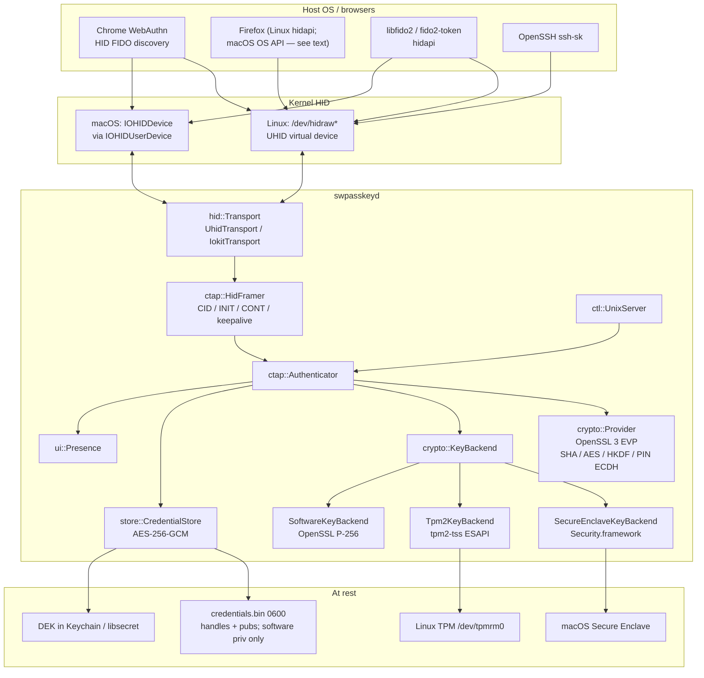
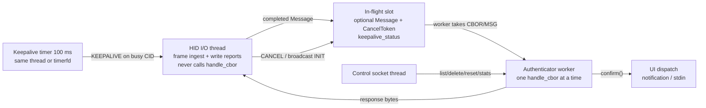

# swpasskey: Software USB-HID FIDO2/CTAP2 Authenticator

| Field | Value |
| --- | --- |
| **Title** | swpasskey — software passkey that enumerates as a USB HID FIDO authenticator |
| **Author** | swpasskey design (rev 3, review-driven) |
| **Date** | 2026-09-06 |
| **Status** | Draft (rev 4 — leftover consistency: K25 Overview, PR numbers, macOS gate, excludeList Deny, 0x40, tpmrm0, install_id/dek, OQ8) |
| **Audience** | Senior engineers implementing v1 |
| **Language** | C++23 |
| **v1 platforms** | Linux, macOS (Windows explicitly out) |
| **AAGUID** | `6fb1dfdd-51c0-43a0-a6f2-f74812cbf8fb` |

---

## Overview

swpasskey is a greenfield C++23 daemon that presents a FIDO2 authenticator to the host OS as a **USB HID FIDO device** (usage page `0xF1D0`, usage `0x01`). Unmodified clients — `libfido2` / `fido2-token`, Chrome, Firefox on Linux, and Chrome on macOS — talk CTAP2 over the standard FIDO HID framing. This is **not** a browser extension, not Chrome's Virtual Authenticator (DevTools protocol), and not a platform authenticator (Touch ID / Windows Hello).

v1 creates the HID device in userspace:

- **Linux:** kernel UHID (`/dev/uhid`) so the device appears as `/dev/hidraw*` and is tagged as a security token by systemd's `fido_id`.
- **macOS:** IOKit `IOHIDUserDevice` so IOHIDManager clients (Chrome, hidapi/`libfido2`) see a FIDO HID collection.

**Credential private keys use a hardware security engine when one is available**, with OpenSSL software P-256 as the fallback:

- **macOS:** Secure Enclave via Security.framework (`kSecAttrTokenIDSecureEnclave`, P-256 only — exact match for ES256). The scalar never leaves the SE.
- **Linux:** TPM 2.0 via tpm2-tss ESAPI. Each credential is a wrapped P-256 ECDSA child of an install-bound ECC primary; NV is **not** consumed per credential.
- **Fallback:** OpenSSL 3 EVP P-256 when SE/TPM is absent, unusable, or `--key-backend=software`.

The authenticator implements a **CTAP 2.1 subset**: `getInfo`, discoverable `makeCredential` / `getAssertion` (ES256 resident keys), packed **self-attestation**, FIDO HID INIT/MSG/CBOR/PING/CANCEL/ERROR/KEEPALIVE, local user-presence confirmation, and an on-disk AES-256-GCM credential store. PIN protocol 2, `hmac-secret`, and CTAP1/U2F follow in immediately subsequent PRs if they stay small.

Attestation is still packed **self-attestation**. Consumer Secure Enclave / TPM ECDSA does **not** yield FIDO MDS-trusted hardware attestation. Same-uid malware cannot *copy* HW-backed private keys, but it **can sign** via TPM ESAPI or Security.framework **without the daemon and without Approve**. The Approve prompt only covers the HID/CTAP path (K25).

---

## Background & Motivation

Hardware security keys (YubiKey, Solo, OpenSK) work because the OS and browsers already speak CTAPHID to any HID device advertising usage page `0xF1D0`. A software implementation that enumerates the same way gets that entire client stack for free: WebAuthn in Chrome, `libfido2`, `ssh-sk`, etc.

Existing software authenticators either:

- live inside the browser (Chrome Virtual Authenticator — useless for `libfido2` / other apps);
- are platform authenticators (Touch ID, Windows Hello — not USB HID, not portable to Linux as a roaming authenticator);
- are dead or heavy (GitHub SoftU2F kext, archived 2020; virtual-fido USB/IP + DriverKit dext);
- are Linux-only UHID daemons (tpm-fido, rust-u2f, linux-id) with varying CTAP2 coverage.

tpm-fido and linux-id already prove the Linux shape: UHID + TPM-wrapped resident keys. Chromium's `crypto/unexportable_key_mac.mm` proves the macOS shape: Security.framework Secure Enclave P-256, non-exportable, tagged Keychain items. swpasskey combines those key backends with a cross-platform CTAPHID daemon.

Pain points this project addresses:

1. Developers and power users want a passkey they control on Linux and macOS, without a physical dongle and without a browser-vendor password manager.
2. macOS Chrome talks HID FIDO devices directly (it does **not** use Apple's WebAuthn API for roaming authenticators), so a virtual HID device is the only way to look like a "real key" to Chrome.
3. Testing CTAP stacks currently requires hardware or USB/IP. A UHID/IOHIDUserDevice authenticator is a first-class local test double for `libfido2`.
4. A pure-software key is extractable by same-uid malware. Binding credential private keys to the SE or TPM raises that bar to "malware can *sign* with the key, not *steal* the scalar." That is **not** the residual of a plugged-in YubiKey: a hardware token enforces UP on-chip. Our Approve prompt is HID-daemon UX only (K25).

---

## Goals & Non-Goals

### Goals (v1)

- Enumerate as a FIDO HID authenticator on **Linux and macOS**.
- Success criteria: `fido2-token -L` lists the device; `fido2-token -I <dev>` prints `FIDO_2_0` (and `FIDO_2_1` only after **PR10** — PIN protocol 2 **and** dual-credRandom hmac-secret; K24), our AAGUID, and `rk`; Chrome on **Linux** can register and assert a discoverable ES256 credential (hard v1 gate, K26). Chrome on macOS is best-effort if the HID entitlement + PR3 `.app` spike succeeds.
- **Use the platform hardware security engine for credential private keys when present** (macOS Secure Enclave, Linux TPM 2.0). OpenSSL software P-256 always compiles and is the automatic fallback.
- CTAP2.1 subset documented in [Protocol Scope](#protocol--crypto-scope-for-v1).
- Persistent encrypted resident-key store, multiple RPs, multiple credentials per RP. Mixed backends allowed (old software creds remain valid after a TPM/SE appears).
- User presence required for every real (non-pre-flight) make/get. No silent assertions.
- Daemon `swpasskeyd` + CLI `swpasskeyctl`.
- Unit tests for HID framing, CBOR, CTAP, crypto, store **without** UHID/TPM/SE (mock `KeyBackend`). Linux integration test against `libfido2`. Optional TPM tests via swtpm; optional SE tests on Apple silicon.

### Non-Goals (v1)

- Windows (including Windows Hello, UMDF virtual HID, USB/IP-on-Windows).
- Appearing as a physical USB device to a **second** computer (USB gadget / device-mode). Macs have no usable USB device controller for this; gadget is a later Linux-only phase (Pi Zero / dwc2).
- USB/IP as the v1 transport.
- NFC, BLE, caBLE / hybrid.
- Platform authenticator APIs (Touch ID WebAuthn, `ASAuthorization`, Windows Hello) **instead of** USB HID. Using the SE as Apple's platform authenticator is a different product.
- Browser extensions or Chrome DevTools Virtual Authenticator.
- **FIDO Alliance certification / MDS-trusted batch attestation** from a TPM EK, Apple App Attest, or a fake Yubico AAGUID. We still do packed self-attestation.
- PCR-sealed store KEK (brittle across kernel/initrd updates).
- Persistent TPM NV slots per credential.
- Importing existing software keys into TPM/SE.
- Biometric / `kSecAccessControlUserPresence` ACL on every SE sign (double-prompt with our FIDO UP UI).
- Large blob, credBlob, minPinLength enforcement beyond advertising, credProtect policies beyond default, bio enrollment, credMan (v1.1).
- Credential export / sync (not iCloud / Google Password Manager passkeys). Backup Eligibility (BE) and Backup State (BS) bits stay **0**.
- C++20 modules.

### Later phases (explicitly sequenced)

- **v1.1:** `authenticatorCredentialManagement` (0x0A) so `swpasskeyctl` / `fido2-cred` can list/delete without a side channel. Optional SE-bound UV (`kSecAccessControlUserPresence`) behind a config flag.
- **v1.2:** Linux USB gadget (configfs HID function) for plugging the machine into another host.
- **v2:** Windows (UMDF or USB/IP + Windows Hello/TPM as `KeyBackend`), optional DriverKit dext if IOHIDUserDevice is insufficient for a target browser.

---

## Key Decisions

| # | Decision | Rationale |
| --- | --- | --- |
| K1 | **C++23, no modules, `std::expected`, no exceptions in the authenticator core** | Matches the request. CTAP errors are status bytes; `std::expected<T, Status>` maps 1:1. CLI may use exceptions at `main`. |
| K2 | **CMake 3.28+ / Ninja, `cmake --preset`** | User preference; presets for `debug`, `release`, `asan`, `ci`. |
| K3 | **Linux transport = UHID (`/dev/uhid`)** | Proven path (ChromiumOS `u2fd`, tpm-fido, rust-u2f, fido2-hid-bridge, linux-id). Device shows up as hidraw; systemd `fido_id` matches usage page `0xF1D0`. No extra kernel modules beyond `uhid`. |
| K4 | **macOS transport = IOKit `IOHIDUserDevice`, not USB/IP, not a kext, not DriverKit in v1** | Chrome and libfido2 enumerate via IOHIDManager. SoftU2F's kext is dead (SIP, notarization, archived 2020). USB/IP is not native on macOS. DriverKit dext is a fallback if entitlement / Safari-class visibility fails — it is **not** the v1 default because of system-extension UX and Apple-granted entitlements. |
| K5 | **USB/IP is an alternative, not v1** | It works (virtual-fido) but requires a USB/IP client, extra privilege, and does not help macOS as a first-class peer. Use only if UHID + IOHIDUserDevice are proven insufficient. |
| K6 | **Bulk crypto = OpenSSL 3 EVP; credential signing = `KeyBackend`** | OpenSSL covers SHA-256, AES-GCM, AES-CBC, HKDF, HMAC, RAND, software P-256, PIN ECDH. Signing keys go through `crypto::KeyBackend` so SE/TPM/software share one CTAP path. |
| K7 | **CBOR = Intel tinycbor + a canonical-encode wrapper** | CTAP2 canonical CBOR is a tiny subset (definite lengths, shortest ints, sorted map keys). tinycbor is small C, no JSON. Wrapper in `src/cbor/` enforces canonical form on encode. |
| K8 | **Tests = Catch2 v3** | Header-light, no gtest runner ceremony. FetchContent. Integration tests optionally link `libfido2` if found. |
| K9 | **Packed self-attestation only; reserved AAGUID `6fb1dfdd-51c0-43a0-a6f2-f74812cbf8fb`** | Consumer SE/TPM ECDSA is not a FIDO-certified batch attestation. Self-attestation (sign `authData ‖ clientDataHash` with the **credential** key, omit `x5c`) is spec-correct. RPs that require MDS-trusted hardware attestation will reject us — that is OK. Do not pretend otherwise. |
| K10 | **Discoverable ES256 resident keys only for CTAP2** | Passkeys **are** discoverable credentials. Non-resident CTAP2 credentials are deferred. Algorithm: COSE `-7` (ES256) only. SE only supports P-256; TPM child keys are P-256 to match. |
| K11 | **BE=0, BS=0** | This is a device-bound key, not a multi-device synced passkey. Setting BE would lie to RPs. HW-backed does not change this. |
| K12 | **Store DEK lives in the OS keychain (macOS Keychain / Linux libsecret; 0600 file fallback). PIN is CTAP UV, not the disk DEK.** | Daemon must answer `getInfo` / HID INIT at login without a PIN prompt. The HW engine protects **credential private keys**, not the metadata DEK. PCR-sealed wrapping is explicitly out (K21). Name the Keychain item `dek` everywhere. |
| K13 | **User presence: desktop notification with Approve/Deny, 30 s timeout; never silent.** Pre-flight (`up=false`) is allowed and returns UP=0. | Spec requires evidence of user interaction on USB. CLI stdin is the fallback when no notification daemon is present. |
| K14 | **Advertise `FIDO_2_0` from PR3 through PIN (PR9).** `FIDO_2_1` only after hmac-secret dual credRandom (PR10). See K24. | Chrome is happy with `FIDO_2_0` + `rk`. Claiming 2.1 without dual hmac-secret is a protocol lie. |
| K15 | **HID report descriptor is the 34-byte un-numbered FIDO descriptor (usages 0x20/0x21)** | Matches Yubico, OpenSK, Fuchsia, Linux HID gadget. Numbered reports break hidapi/libfido2/Chrome. |
| K16 | **VID/PID = `0x1209` / `0xF1D0` (pid.codes) until an official PID is assigned** | Discovery is by HID usage page, not VID. `0x1209` is the open-source VID. Apply for a pid.codes PID before any release; do not ship a squatted PID. |
| K17 | **Single in-flight CTAP transaction; HID I/O thread ≠ authenticator worker; keepalive every 100 ms on the in-flight CID** | CTAPHID spec: one transaction, 500 ms inter-packet timeout, keepalive while processing. HID thread frames/writes and pumps keepalives; worker runs `handle_cbor`. Also covers TPM ECDSA latency (100–500 ms). |
| K18 | **No debug logging of private keys, PIN, `pinUvAuthParam`, `sharedSecret`, TPM private blobs, or raw CBOR payloads of make/get** | Structured logs carry request-id, CID, command name, rpId, CTAP status, `key_backend`. |
| K19 | **`KeyBackend` with SE (macOS) / TPM 2.0 (Linux) preferred; OpenSSL software fallback always present** | Binding product requirement. Probe at daemon start (`--key-backend=auto\|se\|tpm\|software`). New `makeCredential` uses the probed backend. Never migrate a software key into HW (would require the scalar in-process; SE/TPM import of external P-256 is limited/unsafe). |
| K20 | **TPM: wrapped child keys, not NV-resident** | TPM NV is tiny (~64 KiB, often less usable). Follow tpm-fido: `Esys_Create` a P-256 ECDSA child, persist `TPM2B_PUBLIC` + `TPM2B_PRIVATE` on disk (useless without this TPM), `Esys_Load` + `Esys_Sign` + `Esys_FlushContext` per assertion. |
| K21 | **No PCR-sealed KEK in v1** | PCR0/7/etc. change across kernel, initrd, firmware, and Secure Boot updates; users would be locked out of their passkeys. SRK-wrapping of credential keys is the HW protection. |
| K22 | **No biometric / `kSecAccessControlUserPresence` ACL on every SE sign in v1** | FIDO UP is our Approve/Deny prompt. Stacking Touch ID on every assertion is bad UX. Optional later as SE-bound UV. Access control is `kSecAccessControlPrivateKeyUsage` only. |
| K23 | **`pinUvAuthToken` is NOT one-shot.** Invalidate on timeout (~30 s idle), PIN change, `authenticatorReset`, or permission-clear — not after a single make/get. | Chrome obtains one token with `mc\|ga`, pre-flights `getAssertion`, then `makeCredential` with the same `pinUvAuthParam`. One-shot invalidation fails the ceremony with `PIN_AUTH_INVALID`. |
| K24 | **Advertise `FIDO_2_1` only when PIN protocol 2 AND CTAP 2.1 hmac-secret (dual credRandom) both exist.** Until then advertise `FIDO_2_0` only. | Claiming 2.1 without dual credRandom makes ssh-sk / WebAuthn PRF get the same secret with and without UV. PR9 (PIN) keeps `FIDO_2_0` (may list `clientPin` / `pinUvAuthToken` as 2.0 options). PR10 (hmac-secret) flips versions to include `FIDO_2_1`. |
| K25 | **User presence is daemon UX, not a TPM/SE policy.** Same-uid malware that can read the store/Keychain can `Esys_Sign` / `SecKeyCreateSignature` without the Approve prompt. | Honest residual (Issue 9). Do not compare to a YubiKey’s on-token UP without this caveat. Optional v1.1: SE `UserPresence` ACL and/or a TPM policy secret that never hits disk in plaintext. |
| K26 | **Linux is the hard v1 gate.** If Apple denies `com.apple.developer.hid.virtual.device` (or AMFI kills an unsigned CLI), macOS HID is best-effort / later; Linux UHID + TPM/software is still a complete v1. | Restricted entitlements need a provisioning profile and a `.app`. Ad-hoc `codesign --sign -` is expected to die under AMFI. |
| K27 | **`credProtect` > 1 → fail closed** (`CTAP2_ERR_UNSUPPORTED_EXTENSION` 0x4B). Do not silently store a weaker rk. | Chrome sometimes sends `credProtect: 3` on passkey create even when we do not advertise the extension. Ignoring it would allow UV=0 assertions against an RP that asked for UV-required. |
| K28 | **v1 config is CLI flags + env only.** No `config.toml`. | Paths table previously listed an unspecified TOML file. Env: `SWPASSKEY_LOG`, `SWPASSKEY_TESTING`, `SWPASSKEY_TPM_UNSAFE_NOTPMRM`. Flags: `--key-backend`, `--store`. |

---

## Proposed Design

### Architecture



Layering is strict: `hid` knows nothing about CTAP; `ctap` knows nothing about UHID vs IOKit and nothing about TPM vs SE (it talks `KeyBackend`); `store` persists opaque handles. This is what makes unit tests possible without `/dev/uhid` or a TPM.

### Runtime threads

HID I/O and CTAP processing **must not** share a thread. Chrome and libfido2 treat missing `CTAPHID_KEEPALIVE` during user presence as a dead authenticator; a single `read()` → `handle_cbor()` loop cannot ingest `CANCEL` or write keepalives.



**HID I/O thread** (owns the `Transport`):

- Loop: `transport.read()` → `HidFramer::ingest`.
- Completed `INIT` / `PING` / `WINK` / `ERROR` are answered **on this thread** (no worker).
- Completed `CBOR` / `MSG`: if the in-flight slot is empty, move the `Message` there, spawn/wake the worker, set `keepalive_status = Processing`. If the slot is occupied by another CID → write `CTAPHID_ERROR` / `ERR_CHANNEL_BUSY` (HID packet, **not** a CBOR status). Exception: `CANCEL` on the busy CID sets `CancelToken`; broadcast `INIT` is always answered.
- `write()` of keepalives, errors, and framed responses happens only here (the worker posts a `Response` onto a lock-free/mutex queue of 64-byte reports).
- **Never** call `handle_cbor` on this thread, and **never** on the IOKit dispatch queue.

**Keepalive state machine** (in-flight CID only):

| Worker state | HID keepalive status | When |
| --- | --- | --- |
| idle (no in-flight CBOR) | none | `getInfo`, INIT, PING — **no keepalives** |
| parsing / excludeList / generate / sign_der / TPM Load | `STATUS_PROCESSING` (0x01) | default while worker is running |
| blocked in `Presence::confirm` | `STATUS_UPNEEDED` (0x02) | worker sets this via an atomic before `confirm()`, restores `PROCESSING` after |
| sending framed response | none | stop timer before the first response INIT packet |

Timer: every 100 ms while in-flight is non-empty, HID thread writes a 1-byte `CTAPHID_KEEPALIVE` report on that CID. Worker never writes to `Transport`.

**Authenticator worker:**

- `handle_cbor` / `handle_u2f` only.
- `CancelToken` is an atomic flag; `confirm()` and long TPM calls poll it.
- TPM `Esys_*` runs here (100–500 ms). Keepalives continue as `PROCESSING`.

**Single outstanding transaction.** Max 4 allocated CIDs; **reap LRU when allocating a 5th**, not on a 2 s timer (clients keep a CID across a user pause). Idle CIDs are only dropped under cap pressure.

Store access is serialized by `std::mutex` inside `CredentialStore`. UI confirmation is synchronous from the worker (`std::promise` / condvar).

`hid::Err` vs `ctap::Status` are **different types**. `HidFramer::ingest` returns `std::expected<std::optional<Message>, hid::Err>`; the HID thread maps `hid::Err` to a `CTAPHID_ERROR` packet. `handle_cbor` never returns HID-only codes (`ChannelBusy`, `Timeout`, `InvalidSeq`) as a CBOR status byte.

### HID report descriptor (normative for v1)

34 bytes, **no Report IDs**, FIDO usages `0x20` (IN) / `0x21` (OUT). This is the descriptor Yubico, OpenSK, Fuchsia, and the Linux fido gadget use. systemd `fido_id` matches usage page `0xF1D0` + usage `0x01` (`FIDO_FULL_USAGE_CTAPHID = 0xf1d00001`).

```cpp
// src/hid/report_descriptor.hpp
namespace swpk::hid {
inline constexpr uint16_t kUsagePage = 0xF1D0;
inline constexpr uint8_t  kUsageCtapHid = 0x01;
inline constexpr std::size_t kReportSize = 64;

inline constexpr uint8_t kReportDescriptor[] = {
    0x06, 0xD0, 0xF1,  // Usage Page (FIDO_USAGE_PAGE)
    0x09, 0x01,        // Usage (FIDO_USAGE_CTAPHID)
    0xA1, 0x01,        // Collection (Application)
    0x09, 0x20,        //   Usage (FIDO_USAGE_DATA_IN)
    0x15, 0x00,        //   Logical Minimum (0)
    0x26, 0xFF, 0x00,  //   Logical Maximum (255)
    0x75, 0x08,        //   Report Size (8)
    0x95, 0x40,        //   Report Count (64)
    0x81, 0x02,        //   Input (Data, Var, Abs)
    0x09, 0x21,        //   Usage (FIDO_USAGE_DATA_OUT)
    0x15, 0x00,        //   Logical Minimum (0)
    0x26, 0xFF, 0x00,  //   Logical Maximum (255)
    0x75, 0x08,        //   Report Size (8)
    0x95, 0x40,        //   Report Count (64)
    0x91, 0x02,        //   Output (Data, Var, Abs)
    0xC0               // End Collection
};
}  // namespace swpk::hid
```

Device identity advertised to the HID stack:

| Property | Value |
| --- | --- |
| Manufacturer | `swpasskey` |
| Product | `swpasskey Software Authenticator` |
| VID | `0x1209` (pid.codes; replace after allocation) |
| PID | `0xF1D0` (development) |
| bcdDevice | `0x0001` |
| Serial | 16 hex chars, generated once, stored next to the credential file |
| Bus / transport | Linux UHID: `BUS_USB` (3). macOS: `kIOHIDTransportKey = "USB"` so clients that filter on transport still see us. |
| Version | `0x0001` |

### FIDO HID framing

Spec: CTAP 2.1 §11.2 ([HTML](https://fidoalliance.org/specs/fido-v2.1-ps-20210615/fido-client-to-authenticator-protocol-v2.1-ps-errata-20220621.html#usb-human-interface-device-usb-hid)).

Packet layout, 64-byte interrupt reports, little-endian CID, big-endian BCNT:

```
INIT (TYPE_INIT = 0x80 set on CMD):
  offset 0  CID  [4]
  offset 4  CMD  [1]   bit7=1, bits6..0 = command
  offset 5  BCNT [2]   big-endian payload length
  offset 7  DATA [57]

CONT (bit7 of SEQ clear):
  offset 0  CID  [4]
  offset 4  SEQ  [1]   0..127
  offset 5  DATA [59]
```

Constants (`src/ctap/hid_defs.hpp`):

```cpp
namespace swpk::ctap {
inline constexpr uint32_t kBroadcastCid     = 0xFFFFFFFFu;
inline constexpr uint8_t  kTypeInit         = 0x80;
inline constexpr uint8_t  kCmdPing          = 0x01;
inline constexpr uint8_t  kCmdMsg           = 0x03;  // CTAP1/U2F
inline constexpr uint8_t  kCmdLock          = 0x04;  // not implemented → ERR_INVALID_CMD
inline constexpr uint8_t  kCmdInit          = 0x06;
inline constexpr uint8_t  kCmdWink          = 0x08;  // optional; v1: no-op success
inline constexpr uint8_t  kCmdCbor          = 0x10;
inline constexpr uint8_t  kCmdCancel        = 0x11;
inline constexpr uint8_t  kCmdKeepalive     = 0x3B;
inline constexpr uint8_t  kCmdError         = 0x3F;
inline constexpr uint8_t  kCapWink          = 0x01;
inline constexpr uint8_t  kCapCbor          = 0x04;
inline constexpr uint8_t  kCapNmsg          = 0x08;  // set only if MSG is NOT implemented
inline constexpr uint8_t  kKeepaliveProcessing = 0x01;
inline constexpr uint8_t  kKeepaliveUpNeeded   = 0x02;
inline constexpr uint8_t  kHidVersion       = 0x02;
inline constexpr std::size_t kMaxMessage    = 7609;
inline constexpr std::size_t kInitPayload   = 57;
inline constexpr std::size_t kContPayload   = 59;
inline constexpr auto kInterPacketTimeout   = std::chrono::milliseconds(500);
inline constexpr auto kKeepaliveInterval    = std::chrono::milliseconds(100);
inline constexpr auto kUserActionTimeout    = std::chrono::seconds(30);
}
```

**CTAPHID_INIT** (broadcast CID `0xFFFFFFFF` or any allocated CID):

- Request payload: 8-byte nonce.
- Response payload (17 bytes): `nonce[8] ‖ newCid[4] ‖ hidVersion[1]=2 ‖ major[1] ‖ minor[1] ‖ build[1] ‖ caps[1]`.
- v1 caps before U2F lands: `kCapCbor | kCapNmsg` (0x0C). After U2F: `kCapCbor | kCapWink` (0x05).
- Allocate CIDs from a 32-bit CSPRNG; reject `0` and `0xFFFFFFFF`. Max 4 simultaneous allocated CIDs; **reap LRU when allocating a 5th**, not on a short idle timer.

**CTAPHID_CBOR**: payload is `cmd[1] ‖ cbor_map`. Response is `status[1] ‖ cbor_map` (status 0x00 = success).

**CTAPHID_MSG**: CTAP1/U2F APDU (PR11). Until then, if NMSG is set, return `ERR_INVALID_CMD`.

**CTAPHID_PING**: echo payload.

**CTAPHID_CANCEL**: abort in-flight CBOR on the same CID; the cancelled command returns `CTAP2_ERR_KEEPALIVE_CANCEL` (0x2D) if we were waiting on UP, else is dropped.

**CTAPHID_ERROR**: `ERR_INVALID_CMD 0x01`, `ERR_INVALID_PAR 0x02`, `ERR_INVALID_LEN 0x03`, `ERR_INVALID_SEQ 0x04`, `ERR_MSG_TIMEOUT 0x05`, `ERR_CHANNEL_BUSY 0x06`, `ERR_LOCK_REQUIRED 0x0A`, `ERR_INVALID_CHANNEL 0x0B`, `ERR_OTHER 0x7F`.

Framer types (`src/ctap/hid_framer.hpp`):

```cpp
namespace swpk::ctap {

struct Message {
  uint32_t cid{};
  uint8_t  cmd{};                 // without TYPE_INIT; e.g. 0x10 for CBOR
  std::vector<uint8_t> payload;
};

enum class HidErr : uint8_t {
  InvalidCmd     = 0x01,
  InvalidPar     = 0x02,
  InvalidLen     = 0x03,
  InvalidSeq     = 0x04,
  MsgTimeout     = 0x05,
  ChannelBusy    = 0x06,
  LockRequired   = 0x0A,
  InvalidChannel = 0x0B,
  Other          = 0x7F,
};

class HidFramer {
public:
  // Framing only. The HID thread maps HidErr → a CTAPHID_ERROR packet on the
  // offending CID. Never feed these codes to handle_cbor.
  std::expected<std::optional<Message>, HidErr>
  ingest(std::span<const uint8_t, 64> report);
  std::vector<std::array<uint8_t, 64>> frame(const Message& msg) const;
  void cancel(uint32_t cid);
  void on_timeout();  // 500 ms inter-packet; emits HidErr::MsgTimeout
};

}  // namespace swpk::ctap
```

Unit tests in `tests/hid_framer_test.cpp` cover: single-packet CBOR, 2- and N-packet CONT sequences, SEQ gaps, BCNT too large, broadcast vs allocated CID, CANCEL mid-CONT, interleaved CID → CHANNEL_BUSY.

### Linux UHID transport

File: `src/hid/uhid_transport.cpp` (`#if defined(__linux__)`).

```cpp
class UhidTransport final : public Transport {
  // open /dev/uhid O_RDWR | O_CLOEXEC
  // write UHID_CREATE2
  // poll/read loop: UHID_OUTPUT → Report; UHID_START/OPEN/CLOSE/GET_REPORT logged
  // write(): UHID_INPUT2 with size=64
};
```

`UHID_CREATE2` fields:

```
name    = "swpasskey Software Authenticator"
phys    = "swpasskey"
uniq    = serial
rd_size = 34
rd_data = kReportDescriptor
bus     = BUS_USB (0x03)
vendor  = 0x1209
product = 0xF1D0
version = 0x0001
country = 0
```

Event loop: `poll()` on the uhid fd. `UHID_OUTPUT` carries the 64-byte host report (`u.output.data`, `u.output.size` should be 64). Device→host uses `UHID_INPUT2`. Answer `UHID_GET_REPORT` with a zeroed 64-byte input report so the kernel does not stall.

Permissions — ship **only** UHID + hidraw rules in `packaging/linux/udev/90-swpasskey.rules`. **Do not** retag `/dev/tpmrm*`: distros already own TPM nodes (`GROUP=tss`, typically **no** `uaccess`). A FIDO package must not grant the active seat ACL on the resource manager.

```
# Allow the active seat to create the virtual HID device.
KERNEL=="uhid", SUBSYSTEM=="misc", TAG+="uaccess", GROUP="plugdev", MODE="0660"

# Our virtual FIDO device (VID/PID); fido_id will also tag by usage page.
KERNEL=="hidraw*", SUBSYSTEM=="hidraw", ATTRS{idVendor}=="1209", ATTRS{idProduct}=="f1d0", TAG+="uaccess", GROUP="plugdev", MODE="0660"
```

TPM access is documented, not shipped:

```
# README: rely on distro TPM udev. Typical:
sudo usermod -aG tss $USER   # then re-login
# Do NOT add TAG+="uaccess" on tpmrm in our rules.
```

Runtime notes:

```
sudo modprobe uhid
# log out/in after udev + group changes
fido2-token -L          # expect /dev/hidrawN: vendor=0x1209, product=0xf1d0
```

### macOS IOHIDUserDevice transport

File: `src/hid/iokit_transport.mm` (`#if defined(__APPLE__)`).

C API (IOKit, not the Swift CoreHID `HIDVirtualDevice` actor — we stay C++/ObjC++):

```objc
NSDictionary *props = @{
  @(kIOHIDReportDescriptorKey): [NSData dataWithBytes:kReportDescriptor length:34],
  @(kIOHIDVendorIDKey):         @(0x1209),
  @(kIOHIDProductIDKey):        @(0xF1D0),
  @(kIOHIDVersionNumberKey):    @(0x0001),
  @(kIOHIDManufacturerKey):     @"swpasskey",
  @(kIOHIDProductKey):          @"swpasskey Software Authenticator",
  @(kIOHIDSerialNumberKey):     @(serial),
  @(kIOHIDTransportKey):        @"USB",
};
IOHIDUserDeviceRef dev = IOHIDUserDeviceCreate(kCFAllocatorDefault,
                                               (__bridge CFDictionaryRef)props);
IOHIDUserDeviceRegisterSetReportCallback(dev, &OnSetReport, ctx);
IOHIDUserDeviceScheduleWithDispatchQueue(dev, queue);
IOHIDUserDeviceHandleReport(dev, report, 64);
```

`OnSetReport` is host→device (the 64-byte CTAPHID frame).

**Entitlements (mandatory on modern macOS) and packaging shape:**

Restricted entitlements (`com.apple.developer.hid.virtual.device`, `keychain-access-groups`) **require a paid-team provisioning profile**. Ad-hoc `codesign --sign -` with those keys in the plist is an AMFI kill (`no eligible provisioning profiles`), not a NULL `IOHIDUserDeviceCreate`. `keychain-access-groups` on an unbundled CLI does not match how Chromium’s `.app` uses SE. `UNUserNotificationCenter` actionable categories need an `Info.plist` bundle ID.

v1 macOS HID/SE/notifications therefore ship as a **tiny `.app`** (`swpasskeyd.app`, bundle ID `io.github.swpasskey.daemon`) signed with a development or Developer ID profile — **not** a naked terminal binary. The PR3 spike must use that `.app` + paid-team profile. **Linux is the hard v1 gate** if Apple denies the entitlement (K26).

Split entitlements:

- `packaging/macos/swpasskeyd.debug.entitlements` — HID + keychain-access-groups + `com.apple.security.get-task-allow` (debug only).
- `packaging/macos/swpasskeyd.entitlements` — HID + keychain-access-groups, **no** `get-task-allow` (release / notarization).

```xml
<!-- packaging/macos/swpasskeyd.entitlements (release) -->
<?xml version="1.0" encoding="UTF-8"?>
<!DOCTYPE plist PUBLIC "-//Apple//DTD PLIST 1.0//EN"
  "http://www.apple.com/DTDs/PropertyList-1.0.dtd">
<plist version="1.0">
<dict>
  <key>com.apple.developer.hid.virtual.device</key>
  <true/>
  <key>keychain-access-groups</key>
  <array>
    <string>$(AppIdentifierPrefix)io.github.swpasskey</string>
  </array>
</dict>
</plist>
```

FIDO devices are **not** keyboards/mice, so Accessibility TCC should **not** be required (Apple DTS: the Accessibility prompt is tied to keyboard/pointer virtual devices, not HID in general). If a prompt appears, we got the usage page wrong.

**Browser matrix on macOS (honest):**

| Client | Talks to IOHIDUserDevice FIDO? | Notes |
| --- | --- | --- |
| **Chrome** | **Best-effort / K26** | Chrome enumerates HID usage page `0xF1D0` via IOHIDManager (`device/fido/hid`). Success depends on the PR3 signed `.app` spike. Not a v1 release gate. |
| **libfido2** | **Best-effort / K26** | hidapi → IOHIDManager. Same entitlement / `.app` dependency as Chrome. Linux libfido2 is the gate. |
| **Firefox** | Unknown / unlikely by default | Firefox on macOS uses Apple's OS WebAuthn API (`security.webauthn.osmanaged`). Not a v1 gate. |
| **Safari** | **Likely no in v1** | Safari uses AuthenticationServices / CryptoTokenKit, which historically binds to **USB** HID FIDO devices in the USB plane, not `IOHIDUserDevice` nodes. We do **not** promise Safari. |

**DriverKit fallback (not v1):** a dext that vends an `IOHIDDevice` in the USB HID family. Revisit only if Chrome+libfido2 fail on IOHIDUserDevice.

`hid::Transport` (`include/swpasskey/hid/transport.hpp`):

```cpp
namespace swpk::hid {

struct DeviceConfig {
  uint16_t vid{0x1209};
  uint16_t pid{0xF1D0};
  std::string manufacturer{"swpasskey"};
  std::string product{"swpasskey Software Authenticator"};
  std::string serial;
};

class Transport {
public:
  virtual ~Transport() = default;
  virtual Result<void> open() = 0;
  virtual void close() noexcept = 0;
  virtual Result<std::array<uint8_t, kReportSize>> read() = 0;  // blocking
  virtual Result<void> write(std::span<const uint8_t, kReportSize>) = 0;
};

std::unique_ptr<Transport> make_transport(DeviceConfig cfg);

}  // namespace swpk::hid
```

**`IokitTransport` (PR3, not implied leftover):** IOHIDUserDevice is callback-based; a blocking `read()` on the same dispatch queue as `ScheduleWithDispatchQueue` deadlocks.

- Dedicated serial `dispatch_queue` (or CFRunLoop thread) **owned by IokitTransport**, distinct from the authenticator worker and from the HID I/O thread’s idea of “I wait on a fd”.
- `IOHIDUserDeviceRegisterSetReportCallback` → `OnSetReport` copies the 64-byte report into a mutex+condvar/`std::counting_semaphore` queue (depth ≥ 8).
- `read()` pops that queue (blocking). The HID I/O thread is the only caller of `read()`.
- `write()` calls `IOHIDUserDeviceHandleReport` (device→host). Safe from the HID I/O thread; do not call it from the IOKit queue if Apple documents re-entrancy limits — if needed, bounce via `dispatch_async` onto the device queue.
- `IOHIDUserDeviceRegisterGetReportCallback`: return 64 zero bytes (same as UHID `GET_REPORT`).
- **Never** call `handle_cbor` on the IOKit queue.

UHID still fits pollable `read()`/`write()` on `/dev/uhid` (`UHID_OUTPUT` / `UHID_INPUT2` / `UHID_GET_REPORT` → 64 zeros). Both backends satisfy the same `Transport` interface; only the IOKit adapter is extra.

---

### Hardware key backends

This is the v1 difference versus a pure-software authenticator. Bulk primitives stay on OpenSSL. **Credential signing keys** go through `crypto::KeyBackend`.

#### Public interface

`include/swpasskey/crypto/key_backend.hpp`:

```cpp
namespace swpk::crypto {

enum class BackendKind : uint8_t { Software = 0, Tpm2 = 1, SecureEnclave = 2 };

struct P256PublicKey { std::array<uint8_t, 32> x{}, y{}; };

class SigningKey {
public:
  virtual ~SigningKey() = default;
  virtual BackendKind kind() const = 0;
  virtual P256PublicKey pub() const = 0;
  // FIDO packed / assertion: ECDSA-SHA256 over the raw message
  // (authenticatorData || clientDataHash). Return IEEE/RFC 3279 DER.
  virtual Result<std::vector<uint8_t>> sign_der(std::span<const uint8_t> message) const = 0;
  // Opaque persist blob. Software: empty (scalar lives in store::Credential::priv
  // and is written only via SoftwareKeyBackend::export_scalar_for_store, never via this).
  // TPM: TPM2B_PUBLIC || TPM2B_PRIVATE (and we keep srk_unique_seed at store level).
  // SE: application tag bytes.
  virtual std::vector<uint8_t> persist_handle() const = 0;
};

class KeyBackend {
public:
  virtual ~KeyBackend() = default;
  virtual BackendKind kind() const = 0;
  virtual Result<std::unique_ptr<SigningKey>> generate() = 0;
  virtual Result<std::unique_ptr<SigningKey>> load(std::span<const uint8_t> handle,
                                                   const P256PublicKey& pub) = 0;
  virtual Result<void> destroy(std::span<const uint8_t> handle) = 0;
  // Variable-length secret wrap for hmac-secret (CTAP 2.1 dual credRandom
  // is 64 bytes: CredRandomWithUV || CredRandomWithoutUV).
  // Software: identity (caller still stores the result inside the DEK envelope).
  // TPM: seal under the install-bound primary (TPM2_Create keyedhash NULL).
  // SE: Keychain generic-password item tagged from the secret id.
  virtual Result<std::vector<uint8_t>> wrap_secret(std::span<const uint8_t> secret) = 0;
  virtual Result<std::vector<uint8_t>> unwrap_secret(std::span<const uint8_t> wrapped) = 0;
};

// --key-backend=auto|se|tpm|software
// macOS auto: SecureEnclave if probe succeeds else Software
// Linux auto: Tpm2 if /dev/tpmrm0 + Esys_Initialize succeed else Software
std::unique_ptr<KeyBackend> probe_key_backend(std::string_view pref);

}  // namespace swpk::crypto
```

**There is no `P256PrivateKey::scalar()` on the signing API.** Software serialization of the scalar is a private method of `SoftwareKeyBackend` used only by `CredentialStore` when `backend == Software`. HW keys cannot export a scalar; calling code that needs to sign holds a `SigningKey`.

Probe order (`src/crypto/probe.cpp`):

```
pref software → SoftwareKeyBackend
pref se       → SecureEnclaveKeyBackend or fail (no silent fallback)
pref tpm      → Tpm2KeyBackend or fail
pref auto / omitted:
  #ifdef __APPLE__  try SE (SecKeyCreateRandomKey with kSecAttrTokenIDSecureEnclave
                    on a throwaway tag, then SecItemDelete); else Software
  #elif __linux__   try Tss2_TctiLdr_Initialize("device:/dev/tpmrm0") then
                    Esys_Initialize; else Software.
                    /dev/tpm0 (no kernel RM) is NOT probed unless
                    SWPASSKEY_TPM_UNSAFE_NOTPMRM=1 — a second process
                    using the TPM will desync sessions.
  #else             Software
```
`--key-backend=tpm` when the binary was built with `SWPASSKEY_TPM=OFF` is a **startup hard error** ("rebuild with libtss2"), not a link error at the call site and not a silent software fallback. `--key-backend=se` on a non-Apple build is the same class of error.

`--key-backend=se` on Linux or `--key-backend=tpm` on macOS is a hard error at startup.

#### macOS Secure Enclave (`src/crypto/se_key_backend.mm`)

Compile as Objective-C++. Link `Security.framework` + `Foundation.framework`. C API only — **not** Swift CryptoKit.

Availability: Apple silicon Macs; Intel Macs with T1/T2 + Touch ID. Probe by try-create. Intel without SE → software fallback (auto) or startup failure (`--key-backend=se`).

Key generation:

```objc
SecAccessControlRef ac = SecAccessControlCreateWithFlags(
    kCFAllocatorDefault,
    kSecAttrAccessibleAfterFirstUnlockThisDeviceOnly,
    kSecAccessControlPrivateKeyUsage,   // NOT UserPresence, NOT BiometryAny
    &err);

NSData *tag = /* "io.github.swpasskey.se." + 32-byte cred_id hex */;

NSDictionary *attrs = @{
  (id)kSecAttrTokenID: (id)kSecAttrTokenIDSecureEnclave,
  (id)kSecAttrKeyType: (id)kSecAttrKeyTypeECSECPrimeRandom,
  (id)kSecAttrKeySizeInBits: @256,
  (id)kSecAttrLabel: @"swpasskey",
  (id)kSecPrivateKeyAttrs: @{
    (id)kSecAttrIsPermanent: @YES,
    (id)kSecAttrApplicationTag: tag,
    (id)kSecAttrAccessControl: (__bridge id)ac,
    (id)kSecUseDataProtectionKeychain: @YES,
    (id)kSecAttrAccessGroup: @"$(AppIdentifierPrefix)io.github.swpasskey",
  },
};
SecKeyRef priv = SecKeyCreateRandomKey((__bridge CFDictionaryRef)attrs, &error);
SecKeyRef pub  = SecKeyCopyPublicKey(priv);
CFDataRef ext  = SecKeyCopyExternalRepresentation(pub, &error);
// ext is 0x04 || x[32] || y[32]
```

Load: `SecItemCopyMatching` with `kSecClassKey`, `kSecAttrApplicationTag`, `kSecAttrKeyTypeECSECPrimeRandom`, `kSecAttrTokenIDSecureEnclave`, `kSecReturnRef`.

Sign — pick **one** algorithm and stick to it:

**`kSecKeyAlgorithmECDSASignatureMessageX962SHA256`**

FIDO packed/assertion signs `SHA-256(authenticatorData || clientDataHash)` then ECDSA. The Message variant hashes internally with SHA-256 and returns X9.62 DER. Pass the raw concatenation as the message. Do **not** pre-hash and then also use the Message API (that would be SHA-256(SHA-256(m))). Do **not** mix with `kSecKeyAlgorithmECDSASignatureDigestX962SHA256` unless every call site pre-hashes — we will not.

Destroy: `SecItemDelete` with the same tag. Factory reset iterates all tags with label `swpasskey` in our access group.

`wrap_secret`: `SecItemAdd` a `kSecClassGenericPassword` with account `hmac.<cred_id_hex>`, service `io.github.swpasskey`, `kSecAttrAccessibleAfterFirstUnlockThisDeviceOnly`, same access group. Handle = the account string. Honest: this is Keychain Data Protection, not an SE wrapping key. ECIES-to-the-credential-SE-key is a v1.1 upgrade if we want the hmac secret to die with the SE key itself.

Prior art: Chromium [`crypto/unexportable_key_mac.mm`](https://source.chromium.org/chromium/chromium/src/+/main:crypto/unexportable_key_mac.mm); Apple [Protecting keys with the Secure Enclave](https://developer.apple.com/documentation/security/protecting-keys-with-the-secure-enclave). Apple DTS: material is SE-wrapped/operated, **not** a FIDO-certified batch attestation.

#### Linux TPM 2.0 (`src/crypto/tpm2_key_backend.cpp`)

Libraries: `libtss2-esys`, `libtss2-tctildr` (pkg-config `tss2-esys tss2-tctildr`). Device: **`/dev/tpmrm0` only**. User in group `tss`. **`/dev/tpm0` is never a silent last-resort** (no kernel RM → a second process desyncs sessions). Probe it only if `SWPASSKEY_TPM_UNSAFE_NOTPMRM=1`. TPM 1.2 is ignored.

**Do not persist one NV index per credential.** Follow [tpm-fido](https://github.com/psanford/tpm-fido):

1. **Install-bound ECC primary (SRK-equivalent), owner hierarchy.**
   - Do **not** reuse the well-known persistent SRK `0x81000001` (shared with other software; not install-bound).
   - Store a 32-byte `srk_unique_seed` in the encrypted store (generated once). This seed plus the frozen template below **is** the primary; a later “fix” of the KDF would make every `persist_handle` unloadable — treat the template as format-stable.
   - Each daemon start: `Esys_CreatePrimary(ESYS_TR_RH_OWNER, …)` with the frozen `TPM2B_PUBLIC` in-public. Cache the `ESYS_TR` for process lifetime; `Esys_FlushContext` on shutdown.
   - tpm-fido is **inspiration** for wrapped children + stuffing uniqueness into `TPMT_PUBLIC.unique`. It is **not** a drop-in: tpm-fido CreatePrimary’s a **per-registration** ECC primary (unique = HKDF(seed, appId)) and puts the seed in the U2F key handle. Our resident-key model is **one** install-bound primary + disk-wrapped children.

   **Frozen primary `TPM2B_PUBLIC` in-public (normative):**

   | Field | Value |
   | --- | --- |
   | `type` | `TPM2_ALG_ECC` |
   | `nameAlg` | `TPM2_ALG_SHA256` |
   | `objectAttributes` | `RESTRICTED \| DECRYPT \| FIXEDTPM \| FIXEDPARENT \| SENSITIVEDATAORIGIN \| USERWITHAUTH \| NODA` |
   | `authPolicy` | empty |
   | `parameters.eccDetail.symmetric` | AES-128-CFB (`TPM2_ALG_AES`, 128, `TPM2_ALG_CFB`) |
   | `parameters.eccDetail.scheme` | `TPM2_ALG_NULL` |
   | `parameters.eccDetail.curveID` | `TPM2_ECC_NIST_P256` |
   | `parameters.eccDetail.kdf` | `TPM2_ALG_NULL` |
   | `unique.x` | 32 bytes = `HKDF-SHA-256(IKM=srk_unique_seed, salt=32×0x00, info="swpasskey-ecc-primary-unique", L=32)` |
   | `unique.y` | empty (`size=0`) |

   Unit-test this template **without a TPM**: given a fixed seed, assert the marshalled `TPM2B_PUBLIC` bytes (golden hex in `tests/tpm_primary_template_test.cpp`).

2. **Child signing key per credential** — `Esys_Create`:
   - Type `TPM2_ALG_ECC`, curve `TPM2_ECC_NIST_P256`.
   - Scheme `TPM2_ALG_ECDSA` / `TPM2_ALG_SHA256` (`TPMS_SIG_SCHEME_ECDSA`).
   - Attributes: `TPMA_OBJECT_SIGN_ENCRYPT | TPMA_OBJECT_FIXEDTPM | TPMA_OBJECT_FIXEDPARENT | TPMA_OBJECT_SENSITIVEDATAORIGIN | TPMA_OBJECT_USERWITHAUTH | TPMA_OBJECT_NODA`. **Not** restricted.
   - Auth: a 32-byte `tpm_object_auth` generated once, stored in the encrypted store. **Not** the user PIN (PIN retries are CTAP-level; stuffing PIN into TPM DA can lock the whole chip for other users). Empty auth is acceptable but the daemon-local high-entropy auth is better if wrapped blobs leak without store plaintext.
   - Persist `outPublic` (`TPM2B_PUBLIC`) and `outPrivate` (`TPM2B_PRIVATE`) as `persist_handle`:
     ```
     handle = u16be(pub.size) || pub.buffer || u16be(priv.size) || priv.buffer
     ```
     These blobs are inert without this TPM **and** this primary (the unique seed).

3. **Sign:** `Esys_Load(primary, pub, priv)` → `Esys_TR_SetAuth(esys, keyHandle, &tpm_object_auth)` **before** `Esys_Sign` (password session with unset object auth → `TPM_RC_BAD_AUTH`). `Esys_Sign` with `TPMT_SIG_SCHEME { scheme = TPM2_ALG_ECDSA, details.ecdsa.hashAlg = TPM2_ALG_SHA256 }` and `TPM2B_DIGEST` = SHA-256(message) computed in software. Convert `TPMS_SIGNATURE_ECDSA.{signatureR, signatureS}` through the shared `ecdsa_p256_rs_to_der_low_s(r, s)` (INTEGER padding for high bit; WebAuthn low-S — if `s > n/2` replace with `n-s`). `Esys_FlushContext` the transient.

4. **Destroy:** no NV to free. Delete the wrapped blobs from the store. Transient objects are flushed.

5. **`wrap_secret` (hmac-secret dual credRandom, 64 bytes).** Do **not** copy the signing-child template: if `inSensitive.sensitive.data` is non-empty, `TPMA_OBJECT_SENSITIVEDATAORIGIN` **MUST be CLEAR** or the TPM returns `TPM_RC_ATTRIBUTES` and Unseal cannot return `cred_random`.

   **Frozen sealed-object template:**

   | Field | Value |
   | --- | --- |
   | `type` | `TPM2_ALG_KEYEDHASH` |
   | `nameAlg` | `TPM2_ALG_SHA256` |
   | `objectAttributes` | `FIXEDTPM \| FIXEDPARENT \| USERWITHAUTH \| NODA` only. **No** SIGN, DECRYPT, RESTRICTED, **no SENSITIVEDATAORIGIN**. |
   | `parameters.keyedHashDetail.scheme` | `TPM2_ALG_NULL` |
   | `unique` | empty |
   | `inSensitive.sensitive.userAuth` | `tpm_object_auth` |
   | `inSensitive.sensitive.data` | the secret (32 or 64 bytes; 64 for CTAP 2.1 hmac-secret) |

   Unwrap: `Esys_Load` → `Esys_TR_SetAuth(esys, handle, &tpm_object_auth)` → `Esys_Unseal`. Persist wrapped `TPM2B_PUBLIC`||`TPM2B_PRIVATE` as the handle (same encoding as signing children).

ESAPI calls (exact names):

```
Tss2_TctiLdr_Initialize("device:/dev/tpmrm0", &tcti)
Esys_Initialize(&esys, tcti, nullptr)
Esys_TR_SetAuth(esys, ESYS_TR_RH_OWNER, &owner_auth)  // empty unless the owner auth is set
Esys_CreatePrimary(esys, ESYS_TR_RH_OWNER, ESYS_TR_PASSWORD, ESYS_TR_NONE, ESYS_TR_NONE,
                   &inSensitive, &inPublic, nullptr, nullptr, &primaryHandle,
                   &outPublic, &creationData, &creationHash, &creationTicket)
Esys_Create(esys, primaryHandle, ESYS_TR_PASSWORD, ESYS_TR_NONE, ESYS_TR_NONE,
            &inSensitive, &inPublic, nullptr, nullptr,
            &outPrivate, &outPublic, ...)
Esys_Load(esys, primaryHandle, ESYS_TR_PASSWORD, ESYS_TR_NONE, ESYS_TR_NONE,
          outPrivate, outPublic, &keyHandle)
Esys_TR_SetAuth(esys, keyHandle, &tpm_object_auth)   // required before Sign/Unseal
Esys_Sign(esys, keyHandle, ESYS_TR_PASSWORD, ESYS_TR_NONE, ESYS_TR_NONE,
          &digest, &inScheme, &validation, &signature)
Esys_FlushContext(esys, keyHandle)
Esys_Unseal(...)   // wrap_secret reverse
Esys_Finalize(&esys)
Tss2_TctiLdr_Finalize(&tcti)
```

CMake: `SWPASSKEY_TPM` auto-ON if pkg-config finds `tss2-esys` and `tss2-tctildr`. **Never hard-fail the Linux build** if those headers are missing — `SoftwareKeyBackend` always compiles; `tpm2_key_backend.cpp` is behind `if(SWPASSKEY_TPM)`.

Prior art: [tpm-fido](https://github.com/psanford/tpm-fido), [linux-id](https://github.com/matejsmycka/linux-id), tpm2-tss-engine / tpm2-openssl.

#### Software backend (`src/crypto/software_key_backend.cpp`)

Always compiled. OpenSSL `EVP_PKEY_Q_keygen("EC", "P-256")`, `EVP_DigestSign` with `EVP_sha256()` (hashes the message, returns DER), then `ecdsa_p256_der_normalize_low_s` so high-S OpenSSL/TPM/SE signatures become low-S. `persist_handle()` returns empty. Package-internal `SoftwareKeyBackend::export_scalar_for_store()` (not on `SigningKey`, not a `friend` of `CredentialStore`) is called by the store **only** when `kind()==Software`. `OPENSSL_cleanse` on destroy. `wrap_secret` is identity (variable-length).

#### Mixed backends and migration

- Store records carry `backend: uint`.
- Old software creds remain usable after the user grows a TPM/SE. `load()` dispatches on the record's `backend` field, **not** on the process-wide probed backend. That implies the daemon holds **two** backends when mixed: the probed HW backend plus a SoftwareKeyBackend for legacy rows. `Authenticator` therefore has `KeyBackend& primary` (new makeCredential) and `KeyBackend& software` (always).
- **Never migrate** a software key into HW. Import of an external P-256 scalar into SE is not supported. TPM `TPM2_Import` of an external ECC key is possible but unsafe (the scalar hit process memory once; we would be pretending the key was born in HW). New registrations get HW.
- If the HW backend disappears (TPM cleared, SE keychain wiped, `--key-backend=software` after HW creds exist): HW rows fail `load` with `Status::InvalidCredential` / log `key_backend_unavailable`; they are not silently re-signed in software.

#### What stays software

| Secret | Backend |
| --- | --- |
| Credential ECDSA P-256 | SE / TPM / software per K19 |
| PIN protocol 2 `authenticatorKeyAgreementKey` | **Software ephemeral OpenSSL** (session ECDH, not a credential) |
| Store DEK | Keychain / libsecret (K12). Not PCR-sealed. |
| hmac-secret `cred_random` | `KeyBackend::wrap_secret` (TPM seal / SE Keychain item / software identity) |
| U2F batch attestation key (PR11) | Software (not a user credential; self-signed anyway) |

---

### CTAP authenticator

File: `src/ctap/authenticator.cpp`. Public API:

```cpp
namespace swpk::ctap {

class Authenticator {
public:
  Authenticator(AuthenticatorConfig cfg,
                crypto::Provider& crypto,
                crypto::KeyBackend& primary_keys,   // new makeCredential
                crypto::KeyBackend& software_keys,  // legacy rows; may alias primary
                store::CredentialStore& store,
                ui::Presence& presence);

  Result<std::vector<uint8_t>> handle_cbor(std::span<const uint8_t> request,
                                           CancelToken& cancel);
  Result<std::vector<uint8_t>> handle_u2f(std::span<const uint8_t> request,
                                          CancelToken& cancel);
  GetInfoSnapshot get_info() const;
};

}  // namespace swpk::ctap
```

Error policy: every CTAP path returns `std::expected<std::vector<uint8_t>, Status>` where `Status` **is** the CTAP status byte. The HID layer prefixes that byte onto the CBOR body (empty body on error). No exceptions cross this boundary. Core is compiled with `-fno-exceptions -fno-rtti`.

```cpp
namespace swpk {
enum class Status : uint8_t {
  Ok                     = 0x00,
  InvalidCommand         = 0x01,  // also a HID error; OK as CBOR status for unknown cmd
  InvalidParameter       = 0x02,
  InvalidLength          = 0x03,
  CborUnexpectedType     = 0x11,
  InvalidCbor            = 0x12,
  MissingParameter       = 0x14,
  LimitExceeded          = 0x15,
  CredentialExcluded     = 0x19,
  Processing             = 0x21,
  InvalidCredential      = 0x22,
  UnsupportedOption      = 0x2B,
  InvalidOption          = 0x2C,
  KeepaliveCancel        = 0x2D,
  NoCredentials          = 0x2E,
  UserActionTimeout      = 0x2F,
  NotAllowed             = 0x30,
  PinInvalid             = 0x31,
  PinBlocked             = 0x32,
  PinAuthInvalid         = 0x33,
  PinAuthBlocked         = 0x34,
  PinNotSet              = 0x35,
  PuattRequired          = 0x36,
  PinPolicyViolation     = 0x37,
  RequestTooLarge        = 0x39,
  ActionTimeout          = 0x3A,
  UpRequired             = 0x3B,
  OperationDenied        = 0x27,
  KeyStoreFull           = 0x28,
  UnsupportedAlgorithm   = 0x26,
  InvalidSubcommand      = 0x3E,
  UnauthorizedPermission = 0x40,  // cm/be/lbw/acfg bits, or mc without rpId
  UnsupportedExtension   = 0x4B,
  Other                  = 0x7F,
};
// HID-only codes (InvalidSeq, Timeout, ChannelBusy, …) live in hid::HidErr,
// not here. handle_cbor never returns them as a CBOR status byte.
template <class T>
using Result = std::expected<T, Status>;
}
```

Internal failures (I/O, OpenSSL, TPM `TSS2_RC`, SE `CFError`, store corruption) map to `Status::Other` and a structured error log **without secrets**.

Option-byte policy (makeCredential):

- `options.up` present and `false` → `InvalidOption` (0x2C), regardless of authenticator version.
- `options.rk` present and `false` → `UnsupportedOption` (0x2B). We only create resident keys.
- `options.uv` present and `true` (no built-in UV) → `InvalidOption` (0x2C).
- `credProtect` present and `> 1` → `UnsupportedExtension` (0x4B). Fail closed; do not store a weaker rk.
- `NotAllowed` (0x30) is for getNextAssertion-without-state and similar, **not** for rk=false.

### authenticatorGetInfo (0x04)

No parameters. `remainingDiscoverableCredentials` is **0x14 (20)**, not 0x15. Omit key 21 (`vendorPrototypeConfigCommands`) — credMgmt/config are non-goals.

getInfo **examples below are non-normative**. Canonical encoding is pinned by a golden hex test (`tests/get_info_golden_test.cpp`) that python-fido2 / libfido2 accept. Integer keys sort as 1,2,3,…; the **options** sub-map is sorted by **encoded text-key bytes**: `alwaysUv`, `clientPin`, `credMgmt`, `makeCredUvNotRqd`, `pinUvAuthToken`, `plat`, `rk`, `up`. `Writer` **sorts map keys itself** (see CBOR wrapper); callers pass unsorted pairs.

Three snapshots — implement only the keys the corresponding PR has code for. Do **not** ship the union on day one (Chrome will then call PIN / hmac-secret and fail).

**PR3 (HID + getInfo only):**

```
{
  1:  ["FIDO_2_0"],
  3:  h'6FB1DFDD51C043A0A6F2F74812CBF8FB',
  4:  { "alwaysUv": false, "credMgmt": false, "makeCredUvNotRqd": false,
        "plat": false, "rk": true, "up": true },
  5:  1200,
  7:  8,
  8:  32,
  9:  ["usb"],
  10: [{ "type": "public-key", "alg": -7 }],
  14: 1,
  20: <remaining resident credential slots>
}
```

**PR9 (PIN protocol 2 landed; hmac-secret not yet). Still `FIDO_2_0` (K24):**

```
{
  1:  ["FIDO_2_0"],
  3:  h'6FB1DFDD51C043A0A6F2F74812CBF8FB',
  4:  { "alwaysUv": false, "clientPin": <PIN-is-set>, "credMgmt": false,
        "makeCredUvNotRqd": false, "pinUvAuthToken": true,
        "plat": false, "rk": true, "up": true },
  5:  1200,
  6:  [2],
  7:  8,
  8:  32,
  9:  ["usb"],
  10: [{ "type": "public-key", "alg": -7 }],
  14: 1,
  20: <remaining>
}
```

**PR10 (dual-credRandom hmac-secret + PIN). Now `FIDO_2_1`:**

```
{
  1:  ["FIDO_2_1", "FIDO_2_0"],          # + "U2F_V2" only after PR11
  2:  ["hmac-secret"],
  3:  h'6FB1DFDD51C043A0A6F2F74812CBF8FB',
  4:  { …same as PR9 PIN snapshot… },
  5:  1200,
  6:  [2],
  7:  8,
  8:  32,
  9:  ["usb"],
  10: [{ "type": "public-key", "alg": -7 }],
  14: 1,
  20: <remaining>
}
```

AAGUID bytes (16): `6f b1 df dd 51 c0 43 a0 a6 f2 f7 48 12 cb f8 fb`.

**Do not** add a non-standard getInfo field for `key_backend`, and **do not** advertise `uv: true` from SE presence. Backend kind belongs in `swpasskeyctl stats` and in logs (`key_backend=tpm2|se|software`).

### authenticatorMakeCredential (0x01)

```mermaid
sequenceDiagram
  participant P as Platform (Chrome / libfido2)
  participant H as HID I/O thread
  participant A as Authenticator worker
  participant U as ui::Presence
  participant K as KeyBackend
  participant S as CredentialStore

  P->>H: CTAPHID_CBOR makeCredential
  H->>A: handle_cbor(0x01, map)
  A->>A: parse CBOR, require ES256
  A->>S: excludeList lookup (no error yet)
  H-->>P: KEEPALIVE UPNEEDED
  A->>U: confirm(MakeCredential, rpId, user)
  alt HID CANCEL during confirm
    A-->>P: CTAP2_ERR_KEEPALIVE_CANCEL (0x2D)  — only this path
  else Deny OR timeout OR Allow
    Note over A: presence-not-obtained (Deny/timeout) still proceeds to excludeList
  end
  alt excludeList hit (after confirm returned; pinUvAuthParam/mc if PIN set)
    A-->>P: CTAP2_ERR_CREDENTIAL_EXCLUDED (0x19)
    Note over A: Deny and timeout both yield 0x19 here, not OPERATION_DENIED
  else Deny (no excludeList hit)
    A-->>P: OPERATION_DENIED
  else timeout (no excludeList hit)
    A-->>P: ACTION_TIMEOUT
  end
  H-->>P: KEEPALIVE PROCESSING
  A->>K: generate()   SE / TPM / software
  K-->>A: SigningKey + pub
  A->>K: wrap_secret(CredRandomWithUV || CredRandomWithoutUV)
  A->>S: put + flush BEFORE any success HID response
  A->>K: sign_der(authData || clientDataHash)
  A-->>P: {1:"packed", 2:authData, 3:{"alg":-7,"sig":DER}}
```

**Request map** (CTAP 2.1 §6.1):

| Key | Field | v1 handling |
| --- | --- | --- |
| 0x01 | clientDataHash (bstr, 32) | required |
| 0x02 | rp {id, name?} | required; bind `rpIdHash = SHA-256(rp.id)`. Reject empty `rp.id` and `rp.id.size() > 255` → `InvalidParameter`. |
| 0x03 | user {id, name?, displayName?} | required; store all three. `user.id.size() > 64` → `LimitExceeded`. |
| 0x04 | pubKeyCredParams | required; pick first `alg == -7`; else `CTAP2_ERR_UNSUPPORTED_ALGORITHM` |
| 0x05 | excludeList | matching credId for this rpIdHash: prompt UP first (and verify `pinUvAuthParam`/`mc` if PIN is set), **then** `CTAP2_ERR_CREDENTIAL_EXCLUDED` (0x19) on Allow, **Deny**, or timeout. Never return excluded before UP. Only HID CANCEL → `KEEPALIVE_CANCEL` (0x2D). Catch2: Deny + matching excludeList → `0x19`. |
| 0x06 | extensions | `hmac-secret` / `hmac-create-secret` (PR10). **`credProtect` present and > 1 → `UnsupportedExtension` (0x4B)** (K27). Ignore other unknown extensions. |
| 0x07 | options | `rk=false` → `UnsupportedOption` (0x2B). `up=false` → `InvalidOption` (0x2C). `uv=true` → `InvalidOption` (0x2C). |
| 0x08 | pinUvAuthParam | PR9 |
| 0x09 | pinUvAuthProtocol | PR9, must be 2 |
| 0x0A | enterpriseAttestation | reject with `INVALID_PARAMETER` |

**Always require user presence.** If PIN is set (PR9), require a valid `pinUvAuthParam` with `mc` permission.

**authData** (WebAuthn Level 3 §6.1):

```
rpIdHash[32] ‖ flags[1] ‖ signCount[4 BE] ‖ attestedCredentialData ‖ [extensions CBOR]
```

flags: `UP (0x01) | UV (0x04 if PIN verified) | AT (0x40) | ED (0x80 if extensions)`. **BE and BS stay 0.**

attestedCredentialData:

```
AAGUID[16] ‖ credIdLen[2 BE] ‖ credId[32] ‖ credentialPublicKey (COSE_Key)
```

COSE_Key (canonical map):

```
{
  1:  2,     # kty EC2
  3: -7,     # alg ES256
 -1:  1,     # crv P-256
 -2:  x,     # bstr 32
 -3:  y      # bstr 32
}
```

**Packed self-attestation** (WebAuthn §8.2) — two CBOR layers. The CTAP **response** uses integer keys; the **attStmt value** is a WebAuthn packed statement with **text** keys `"alg"` / `"sig"` (no `x5c`). Integer keys inside attStmt fail `fido_cred_verify`.

```
# CTAP authenticatorMakeCredential response (canonical integer keys)
{
  1: "packed",                          # fmt
  2: authData,                          # bstr
  3: {"alg": -7, "sig": <DER ECDSA>}    # attStmt, TEXT keys
}
```

`Writer` sorts the inner map (`"alg"` then `"sig"`). Golden hex test that python-fido2 / libfido2 accept (`tests/packed_self_attest_golden_test.cpp`).

No `x5c`. Signature is produced with the **credential** key via `SigningKey::sign_der`, then `ecdsa_p256_der_normalize_low_s`. RPs that understand packed+self accept this; RPs that require a metadata-service trust path will fail closed. That is the product — **including when the key lives in the SE or TPM**.

**Persist-before-send:** `CredentialStore::put` + `flush()` **before** the HID thread frames the success response. Inverse order (send then crash before flush) reuses `signCount` on the next assertion and looks like cloning. Same rule for getAssertion counter bumps. Crash after flush and before send only skips a count, which is safe.

**Credential ID:** 32 bytes from `RAND_bytes`. Not a wrapped private key. The private key lives in SE/TPM (handle in the store) or in the encrypted `priv` field for software.

**signCount:** per-credential `uint32`, start at 1 on create, increment on every UP-asserting getAssertion. Pre-flight (`up=false`) does not increment. Persist immediately.

**Capacity:** `kMaxCredentials = 100`. Beyond that: `CTAP2_ERR_KEY_STORE_FULL`.

### authenticatorGetAssertion (0x02) + getNextAssertion (0x08)

Discoverable (empty allowList) and non-empty allowList both supported.

1. Filter store by `rpIdHash = SHA-256(rpId)` and optional allowList credIds.
2. If none: `CTAP2_ERR_NO_CREDENTIALS`.
3. **PIN / UV policy (`alwaysUv: false`):** getAssertion **without** `pinUvAuthParam` is allowed even if a PIN is set; the assertion has UV=0. makeCredential, by contrast, requires a valid `pinUvAuthParam` with `mc` when PIN is set (`makeCredUvNotRqd: false`). If `pinUvAuthParam` is present: `verify(token, clientDataHash, pinUvAuthParam)`, require `ga` permission, match `permissionsRPID` to `rp.id` if the token was bound to an rpId.
4. If `up` is false (pre-flight): **no prompt, do not increment `signCount`**, flags UP=0 and UV=0 (UV=1 only if a valid `pinUvAuthParam` was verified). **Still `load` + `sign_der`** — CTAP 2.1 returns an assertion including `sig` (key 0x03). Skipping sign produces an invalid response; platforms use this to probe excludeList/allowList. U2F check-only (`P1=0x07`) is the only “no sign” probe; do not conflate it with CTAP2.
5. If `up` is true (default): prompt user presence. If multiple credentials, pick most recently used, stash the rest for `getNextAssertion` (state expires in 30 s).
6. `keys.load(handle, pub)` (dispatch on `record.backend`) then `sign_der(authData ‖ clientDataHash)`.
7. `update_count_and_used` + `flush` **before** framing the success HID response (except pre-flight, which does not bump the counter).
8. Response: `{1: credentialDescriptor, 2: authData, 3: sig, 4: user (if more than one or rk), 5: numberOfCredentials?}`.

Empty allowList + multiple creds: this is the passkey flow. We **must** return `user.id` so the RP can identify the account.

`authenticatorGetNextAssertion` consumes the stashed list; `CTAP2_ERR_NOT_ALLOWED` if no state.

### PIN protocol 2 (PR9, should-have)

Implement `authenticatorClientPIN` (0x06) with **protocol 2 only** (no protocol 1). Subcommands:

| Sub | Name | v1 |
| --- | --- | --- |
| 0x01 | getPINRetries | yes |
| 0x02 | getKeyAgreement | yes |
| 0x03 | setPIN | yes |
| 0x04 | changePIN | yes |
| 0x05 | getPinToken | yes (back-compat; permissions = mc\|ga) |
| 0x09 | getPinUvAuthTokenUsingPinWithPermissions | yes |
| 0x06 | getPinUvAuthTokenUsingUvWithPermissions | no (no built-in UV; SE biometrics are not CTAP uv) |
| 0x07 | getUVRetries | no |

Protocol 2 crypto (CTAP 2.1 §6.5.4) — **all OpenSSL software**:

```
Z = ECDH_P256(auth_priv, platform_pub).x          # 32 bytes, not hashed
hmacKey ‖ aesKey =
    HKDF-SHA-256(salt=32×0x00, IKM=Z, L=32, info="CTAP2 HMAC key") ‖
    HKDF-SHA-256(salt=32×0x00, IKM=Z, L=32, info="CTAP2 AES key")

encrypt(aesKey, pt) = IV[16 random] ‖ AES-256-CBC(aesKey, IV, pt)   # pt multiple of 16
authenticate(hmacKey, msg) = HMAC-SHA-256(hmacKey, msg)             # 32 bytes
```

The authenticator key-agreement key is a **software ephemeral** P-256 key, regenerated on daemon start and on reset. It is a session ECDH key, not a credential; putting it in the SE/TPM would add latency to every PIN protocol handshake for no extract-resistance that matters (the shared secret is already ephemeral).

PIN storage: `LEFT(SHA-256(utf8(pin)), 16)` as on hardware tokens. Min length 4, max 63. Retries: 8. After 8 failures: `CTAP2_ERR_PIN_BLOCKED` until `authenticatorReset`. After 3 consecutive failures, insert a delay 5 s, 10 s, 20 s, … cap 60 s (constant-time compare of the hash still happens first).

**`pinUvAuthToken` is NOT one-shot (K23).** Chrome obtains one token with `mc|ga`, pre-flights `getAssertion`, then `makeCredential` with the same `pinUvAuthParam`. Invalidating after the first use yields `PIN_AUTH_INVALID` mid-ceremony.

PIN state machine (`src/ctap/pin_state.hpp`):

```cpp
struct PinUvAuthToken {
  std::array<uint8_t, 32> bytes{};          // CSPRNG; OPENSSL_cleanse on clear
  uint8_t permissions{};                    // mc=0x01, ga=0x02; others → UNAUTHORIZED_PERMISSION
  std::optional<std::string> permissions_rp_id;  // required when mc is set
  std::chrono::steady_clock::time_point expiry;
};
```

Invalidate the token on: idle timeout (30 s since last successful **verify** — **touch expiry on each successful verify**, do not destroy after one make/get), PIN change, `authenticatorReset`, or an explicit permission-clear. Spec tokens live until those events.

`getPinUvAuthTokenUsingPinWithPermissions` (0x09) request map:

| Key | Field |
| --- | --- |
| 0x01 | pinUvAuthProtocol = 2 |
| 0x02 | subCommand = 0x09 |
| 0x03 | keyAgreement (platform COSE_Key) |
| 0x06 | pinHashEnc |
| 0x09 | permissions bitmask |
| 0x0A | rpId (tstr). **Required when `mc` is set.** Stored on the token as `permissionsRPID`. Unknown permission bits (`cm`/`be`/`lbw`/`acfg`) or `mc` without `rpId` → `UnauthorizedPermission` (0x40). |

**getPinToken (0x05) bind-on-first-use (CTAP 2.1):** token is minted with `permissions = mc|ga` and **no** `permissionsRPID`. The first successful make/get that presents this token **associates** `rp.id` onto the token. A later make/get with a different `rp.id` → `PIN_AUTH_INVALID`. `getPinUvAuthTokenUsingPinWithPermissions` that already carries `rpId` is bound immediately.

make/get with `pinUvAuthParam`:

1. `verify(token.bytes, clientDataHash, pinUvAuthParam)` — protocol 2 HMAC is the **full 32 bytes**, never LEFT-16.
2. Check permission bit (`mc` on makeCredential, `ga` on getAssertion). Missing required bit → `UnauthorizedPermission` (0x40).
3. If the token has `permissionsRPID`, it MUST equal `rp.id`; else `PIN_AUTH_INVALID`. If it has none (getPinToken 0x05), bind `rp.id` on first use as above.

getAssertion UV policy (`alwaysUv: false`): PIN is **not** required. Absent `pinUvAuthParam` → UV=0 is OK even if a PIN is set. Present + valid → UV=1. makeCredential **does** require PIN when set (`makeCredUvNotRqd: false`).

Test against `fido2-token -S` **and** a Chrome register that pre-flights.

### hmac-secret (PR10)

CTAP 2.1 hmac-secret generates **two** 32-byte secrets per credential, **for every credential** (not only when the extension is present):

```
CredRandomWithUV    = RAND_bytes(32)
CredRandomWithoutUV = RAND_bytes(32)
wrapped = wrap_secret(CredRandomWithUV || CredRandomWithoutUV)   # 64 bytes
```

At getAssertion, select by the UV flag actually used in authData: UV=1 → `CredRandomWithUV`; UV=0 → `CredRandomWithoutUV`. Using one 32-byte secret for both would make ssh-sk / WebAuthn PRF return the same value with and without PIN, which 2.1 forbids.

- makeCredential extension in: `{ "hmac-secret": true }` or `{ "hmac-create-secret": true }` → out: `{ "hmac-secret": true }`. Secrets are generated even if the extension is absent (stored wrapped; omitted from authData extensions).
- getAssertion extension in: `{1: platform_pub, 2: saltEnc, 3: saltAuth, 4: pinUvAuthProtocol=2}`. Shared-secret ECDH is **software OpenSSL** (`p256_ecdh_x`). Decrypt salts (32 or 64 bytes) with `aes256cbc_decrypt`. Output `encrypt(sharedSecret, HMAC-SHA256(selectedCredRandom, salt1) [‖ HMAC-SHA256(selectedCredRandom, salt2)])`.

Do **not** advertise `FIDO_2_1` until this PR **and** PIN (PR9) have both landed (K24).

**Wrapping quality (honest):**

| Backend | hmac-secret protection |
| --- | --- |
| TPM2 | 64-byte blob sealed to the install-bound primary. Disk theft of `credentials.bin` without this TPM → inert. **This is the strong case.** |
| Secure Enclave | Keychain generic-password item, same access group / Data Protection class as the SE key. **Not** SE-wrapped; a same-uid process that can read our Keychain items can read `cred_random` even though it cannot export the ES256 scalar. ECIES-to-SE-pub is deferred (v1.1). |
| Software | Identity; lives in the DEK envelope only. |

Do not hide the SE/software limitation. The ES256 private key is the high-value secret; hmac-secret is an extension output used by `ssh-sk` and some password managers.

### CTAP1/U2F (PR11)

`CTAPHID_MSG` framing of U2F_REGISTER / U2F_AUTHENTICATE / U2F_VERSION.

U2F_REGISTER historically requires an X.509 attestation certificate. Generate a **self-signed P-256 cert** at first boot, stored in the encrypted store (software key). RPs that pin U2F attestation metadata will reject it; U2F is compatibility for older sites only.

U2F **user** keys still go through `KeyBackend` (same as CTAP2). Key handle **is** credId (32 bytes). U2F authenticate with `P1=0x07` (check-only) does not require UP.

If this PR grows past ~400 LOC of protocol plus cert generation, drop it from v1.

### authenticatorReset (0x07)

Requires UP within the user-action timeout. Wipes: all credentials (and `KeyBackend::destroy` for each handle — SE `SecItemDelete`; TPM nothing to NV-free), PIN, pinUvAuthToken, key-agreement key, U2F attestation key, `srk_unique_seed`, `tpm_object_auth`. Overwrites `credentials.bin` with zeros then `rename`s a fresh empty store. AAGUID is a **model** identifier and does **not** change. A new `srk_unique_seed` is generated on next TPM use so previously wrapped blobs cannot be reloaded.

### User presence

```cpp
namespace swpk::ui {

enum class Decision { Allow, Deny, Timeout, Cancelled };

struct PresenceRequest {
  enum class Kind { MakeCredential, GetAssertion, Reset, SetPin } kind;
  std::string rp_id;
  std::string user_display;   // may be empty
  std::array<uint8_t, 32> rp_id_hash;
};

class Presence {
public:
  virtual ~Presence() = default;
  virtual Decision confirm(const PresenceRequest&,
                           CancelToken&,
                           std::chrono::milliseconds timeout) = 0;
};

std::unique_ptr<Presence> make_presence(const PresenceConfig&);

}  // namespace swpk::ui
```

Implementations:

- `NotifyPresence` (Linux: libnotify action buttons from a user session with a notification daemon).
- macOS: **requires the `.app` bundle from PR3**. `UNUserNotificationCenter` actionable categories need an `Info.plist` bundle ID and user authorization; `NSAlert` needs a GUI run loop. Notifications themselves are **PR8**. Do not wait for optional packaging (PR13). A LaunchAgent without a .app cannot show Approve/Deny.
- `StdinPresence` fallback: print to the daemon's stderr and read `y/N` from a controlling tty if `isatty(STDIN_FILENO)`, else Timeout. Headless/SSH: stdin-or-fail; document this. Do not install a systemd user unit / LaunchAgent until the non-TTY presence path works on that OS.
- `AlwaysDenyPresence` for tests; `AutoAllowPresence` **only** under `SWPASSKEY_TESTING=1` (never compiled into release presets).

Default timeout 30 s. During the wait the HID thread sends `CTAPHID_KEEPALIVE` / `STATUS_UPNEEDED` every 100 ms. After Approve, keepalives switch to `STATUS_PROCESSING` while TPM/SE sign runs.

---

## API / Interface Changes

Greenfield — no existing API. Public headers live under `include/swpasskey/` and are what `swpasskeyd` / `swpasskeyctl` / tests consume. Nothing is installed as a shared library in v1 (`BUILD_SHARED_LIBS=OFF`); the daemon links the static libs.

### CMake targets

| Target | Type | Sources | Links |
| --- | --- | --- | --- |
| `swpasskey_cbor` | static | `src/cbor/*.cpp` + tinycbor | tinycbor |
| `swpasskey_crypto` | static | `src/crypto/*.cpp` (+ `se_key_backend.mm` on Apple; `tpm2_key_backend.cpp` if `SWPASSKEY_TPM`) | OpenSSL::Crypto; Apple: Security+Foundation; Linux TPM: tss2-esys, tss2-tctildr |
| `swpasskey_store` | static | `src/store/*.cpp` | crypto, cbor, keychain |
| `swpasskey_ctap` | static | `src/ctap/*.cpp` | crypto, store, cbor; `-fno-exceptions` |
| `swpasskey_hid` | static | `src/hid/*.cpp` (+ `.mm` on Apple) | IOKit/CoreFoundation (Apple) |
| `swpasskey_ui` | static | `src/ui/*.cpp` (+ `.mm` on Apple) | libnotify (Linux, optional), Foundation (Apple) |
| `swpasskey_log` | static | `src/log/*.cpp` | none |
| `swpasskeyd` | exe | `src/daemon/main.cpp` | all of the above |
| `swpasskeyctl` | exe | `src/ctl/main.cpp` | log + socket client |
| `swpasskey_tests` | exe | `tests/*.cpp` | Catch2, ctap, crypto, store, cbor, hid_framer (no UHID; mock KeyBackend) |
| `swpasskey_itest` | exe (optional) | `tests/itest/*.cpp` | libfido2 if `SWPASSKEY_ITEST=ON` |

CMake TPM snippet (`cmake/FindTss2.cmake`):

```cmake
find_package(PkgConfig)
if(UNIX AND NOT APPLE)
  pkg_check_modules(TSS2_ESYS IMPORTED_TARGET tss2-esys)
  pkg_check_modules(TSS2_TCTILDR IMPORTED_TARGET tss2-tctildr)
endif()
if(NOT DEFINED SWPASSKEY_TPM)
  if(TSS2_ESYS_FOUND AND TSS2_TCTILDR_FOUND)
    set(SWPASSKEY_TPM ON)
  else()
    set(SWPASSKEY_TPM OFF)
  endif()
endif()
# SWPASSKEY_TPM=OFF must still configure and build (software backend).
```

Daemon flags:

```
swpasskeyd [--key-backend=auto|se|tpm|software] [--store PATH] [--testing]
```

### Control socket (`swpasskeyctl`)

Unix domain socket:

- Linux: `$XDG_RUNTIME_DIR/swpasskey/ctl.sock` (mode 0600, same uid)
- macOS: `$HOME/Library/Application Support/swpasskey/ctl.sock`

Newline-delimited JSON, one request/response per line. No secrets on this channel except PIN set (the socket is 0600 and same-uid).

```
→ {"op":"stats"}
← {"ok":true,"key_backend":"tpm2","probe":"ok","creds":{"software":2,"tpm2":9,"se":0},
    "make_cred":12,"get_assert":40,"hid_init":3,"errors":{"0x31":2}}

→ {"op":"list"}
← {"ok":true,"creds":[{"rp":"example.com","user":"alice","cred_id":"ab...",
    "sign_count":4,"backend":"tpm2"}]}

→ {"op":"delete","cred_id":"ab..."}
← {"ok":true}

→ {"op":"reset"}
← {"ok":true}          # still requires local UP in the daemon

→ {"op":"set-pin","pin":"..."}
← {"ok":true}

→ {"op":"quit"}
```

`swpasskeyctl` flags: `list`, `delete <cred-id-hex>`, `reset`, `set-pin`, `stats`, `log-level <info|debug>`.

---

## Data Model Changes

Greenfield. On-disk layout is the data model.

### Paths

| Item | Linux | macOS |
| --- | --- | --- |
| Store | `$XDG_DATA_HOME/swpasskey/credentials.bin` | `~/Library/Application Support/swpasskey/credentials.bin` |
| Serial sidecar (PR3, before store) | `$XDG_DATA_HOME/swpasskey/serial` (0600, 16 hex chars) | `~/Library/Application Support/swpasskey/serial` |
| Instance lock | `flock` on `credentials.bin` once PR5 exists; until then `flock` `$XDG_RUNTIME_DIR/swpasskey/swpasskeyd.lock` | same, under Application Support / `$TMPDIR` |
| DEK | libsecret schema `io.github.swpasskey.dek` (attr `install_id`); fallback file `credentials.bin.dek` mode 0600 | Keychain service `io.github.swpasskey`, account `dek` |
| Logs | stderr; optional `$XDG_STATE_HOME/swpasskey/swpasskeyd.log` | stderr; optional `~/Library/Logs/swpasskey/swpasskeyd.log` |
| Config | **none in v1** (CLI + env only, K28) | **none in v1** |

v1 config: `--key-backend=auto|se|tpm|software`, `--store PATH`, env `SWPASSKEY_LOG`, `SWPASSKEY_TESTING`, `SWPASSKEY_TPM_UNSAFE_NOTPMRM`. No `config.toml`.

### File format `credentials.bin`

Binary, little-endian, versioned. Outer envelope is **not** CBOR so we can fail closed on magic/version before any decoder runs.

```
offset 0   magic[4]        = 'S' 'W' 'P' 'K'
offset 4   version[u16]    = 1
offset 6   flags[u16]      = 0
offset 8   install_id[16]  = install UUID (matches keychain item)
offset 24  nonce[12]       = AES-GCM nonce
offset 36  ciphertext_len[u32]
offset 40  ciphertext[N]   = AES-256-GCM(DEK, nonce, aad=magic‖version‖install_id)
offset 40+N tag[16]
```

`DEK` is 32 random bytes, stored as the Keychain/libsecret item `dek` (one layer in v1 — there is no separate KEK). Not PCR-sealed. If lock-at-rest mode is enabled later, a PIN-derived KEK would wrap this DEK; until then call the item **DEK** everywhere.

Inner plaintext is CTAP2-canonical CBOR:

```
{
  "aaguid":     bstr(16),
  "install_id": bstr(16),
  "serial":     tstr,
  "pin": {
     "hash":     bstr(16),          # LEFT(SHA-256(PIN), 16); omit if unset
     "retries":  8
  },
  "tpm": {                          # omit if never used
     "srk_unique_seed": bstr(32),
     "object_auth":     bstr(32)
  },
  "u2f_attest": { "priv": bstr, "cert_der": bstr },   # PR11, software
  "creds": [
    {
      "rp_id":        tstr,
      "rp_id_hash":   bstr(32),
      "rp_name":      tstr,
      "user_id":      bstr,
      "user_name":    tstr,
      "user_display": tstr,
      "cred_id":      bstr(32),
      "backend":      uint,          # 0=software, 1=tpm2, 2=se
      "handle":       bstr,          # TPM pub||priv or SE application tag; empty if software
      "priv":         bstr,          # software scalar only; MUST be empty for HW
      "pub_x":        bstr(32),
      "pub_y":        bstr(32),
      "sign_count":   uint,
      "created":      uint,          # unix seconds
      "last_used":    uint,
      "cred_random":  bstr,          # wrap_secret output (64 B: UV || noUV; identity if software)
      "rk":           true
    }
  ]
}
```

In-memory C++ record (`include/swpasskey/store/credential.hpp`):

```cpp
namespace swpk::store {

struct Credential {
  std::string rp_id;
  std::array<uint8_t, 32> rp_id_hash{};
  std::string rp_name;
  std::vector<uint8_t> user_id;
  std::string user_name;
  std::string user_display;
  std::array<uint8_t, 32> cred_id{};
  crypto::BackendKind backend{crypto::BackendKind::Software};
  std::vector<uint8_t> handle;          // empty for software
  std::vector<uint8_t> priv;            // software scalar only; empty for HW
  crypto::P256PublicKey pub{};
  uint32_t sign_count{1};
  uint64_t created_unix{};
  uint64_t last_used_unix{};
  std::vector<uint8_t> cred_random;     // wrap_secret output (64 B dual credRandom)
};

class CredentialStore {
public:
  static Result<CredentialStore> open(const std::filesystem::path& path,
                                      crypto::Provider& crypto,
                                      keychain::Keychain& dek);

  Result<void> put(Credential);
  Result<std::vector<Credential>> find_by_rp(std::span<const uint8_t, 32> rp_id_hash) const;
  Result<std::optional<Credential>> find(std::span<const uint8_t, 32> rp_id_hash,
                                         std::span<const uint8_t> cred_id) const;
  Result<void> update_count_and_used(std::span<const uint8_t> cred_id, uint32_t new_count);
  Result<void> erase(std::span<const uint8_t> cred_id);
  Result<void> factory_reset();  // iterates mixed rows and calls KeyBackend::destroy per handle
  Result<void> try_lock();       // flock the store file; second daemon exits
  std::span<const uint8_t, 32> tpm_srk_unique_seed();  // generate-on-first-use
  std::span<const uint8_t, 32> tpm_object_auth();
  std::size_t size() const;
  std::size_t remaining() const { return kMaxCredentials - size(); }
  std::array<std::size_t, 3> count_by_backend() const;

private:
  Result<void> flush();   // rewrite whole file atomically (write tmp + fsync + rename)
};

}  // namespace swpk::store
```

**Invariant:** `backend != Software` ⇒ `priv.empty()`. `backend == Software` ⇒ `handle.empty()` and `priv.size()==32`. Store `put()` rejects violations.

**Atomicity:** write `credentials.bin.tmp` → `fsync` → `rename` over `credentials.bin`. POSIX rename is atomic on the same filesystem.

**Single instance:** `open()` takes an exclusive `flock` on the store (or the runtime lock file in PR3). A second `swpasskeyd` logs `already running` and exits nonzero. Two daemons would otherwise create two HID devices with the same VID/PID and contend on the store (the mutex is per-process).

**Migration:** `version=1` only in v1. Unknown version → refuse to open (`Status::Other`, log "store version N, this binary speaks 1"). Missing `backend` on a hypothetical future reader is not our problem; we always write it.

### Keychain schema

- macOS DEK: `SecItemAdd` / `SecItemCopyMatching` with `kSecClassGenericPassword`, `kSecAttrService = "io.github.swpasskey"`, `kSecAttrAccount = "dek"`, `kSecAttrAccessible = kSecAttrAccessibleAfterFirstUnlockThisDeviceOnly`, access group `io.github.swpasskey`.
- macOS SE keys: `kSecClassKey` + `kSecAttrApplicationTag` as above.
- Linux: libsecret schema `org.freedesktop.Secret.Generic` with attributes `{ "xdg:schema": "io.github.swpasskey.dek", "install_id": "<hex>" }`. If libsecret is absent or the collection is locked, fall back to `credentials.bin.dek` mode 0600 containing the raw 32-byte DEK — **log a warning**. This fallback is weaker for **software** creds and for metadata; TPM-wrapped private keys remain inert without the TPM.

**Serial stability (PR3 vs PR5):** PR3 creates the HID device **before** the encrypted store exists. It writes a 16-hex-char serial to the sidecar `serial` (0600) next to the eventual store path, generating only if the file is absent. PR5 imports that serial into the inner CBOR `serial` field and **never regenerates**. UHID `uniq` / IOHID `kIOHIDSerialNumberKey` always read the sidecar.

---

## Alternatives Considered

### Transport

| Option | Pros | Cons | Verdict |
| --- | --- | --- | --- |
| **UHID + IOHIDUserDevice (chosen)** | Native HID, Chrome+libfido2 path, no extra bus, proven on Linux | macOS entitlement; Safari likely blind; `/dev/uhid` perms | **v1** |
| USB/IP (virtual-fido) | Looks like a real USB device; helps Windows later | Extra daemon + `vhci-hcd`; not native on macOS; more moving parts; privilege | Rejected for v1; Windows-phase candidate |
| Linux USB gadget (configfs HID) | Appears to a **second** computer as a physical key | Requires UDC (Pi Zero, dwc2); does nothing for the host machine's own Chrome; macOS has no gadget | **Later phase** |
| SoftU2F-style kext | Safari historically saw it | kexts are dead on modern macOS (SIP, notarization, archived 2020) | Rejected |
| DriverKit dext | May sit in the USB HID family; possible Safari | System extension UX, more entitlements, code-signing tax | Fallback if K4 fails |
| Chrome Virtual Authenticator / WebDriver | Easy | Not a HID device; `libfido2` cannot see it; out of scope | Rejected |
| Platform authenticator (Touch ID WebAuthn) | Best macOS UX | Not USB HID; not Linux; not "emulate a USB passkey" | Rejected (K22/non-goal) |

### Crypto library (bulk)

| Option | Pros | Cons | Verdict |
| --- | --- | --- | --- |
| **OpenSSL 3 EVP (chosen)** | Distro/Homebrew, complete primitive set, well-known CMake | API sprawl; must stay on EVP | **v1 bulk + software KeyBackend** |
| BoringSSL / aws-lc | Cleaner, Chrome-grade | Not packaged; FetchContent + extra license surface | No |
| Botan | C++ API | Another ecosystem | No |
| libsodium + a P-256 crate | Nice DX | libsodium has **no** P-256 | Impossible without a second lib |

### Credential key protection

| Option | Pros | Cons | Verdict |
| --- | --- | --- | --- |
| **SE / TPM via KeyBackend, OpenSSL fallback (chosen)** | Matches the product requirement; CTAP is backend-agnostic; software always compiles | Two extra deps (tss2, Security.framework); probe/fallback complexity; mixed-backend rows | **v1** |
| Software-only | Simplest | Same-uid malware extracts keys. Rejected as the default. | Fallback only |
| PCR-sealed DEK | Store inert after PCR change | Kernel/initrd/firmware updates lock users out | Rejected (K21) |
| Persistent TPM NV per credential | Simple Load by handle | NV is tiny; 100 creds will not fit; survives poorly across owner-clear | Rejected (K20) |
| Well-known persistent SRK `0x81000001` | Matches TCG provisioning | Shared with other apps; not install-bound; `tpm2_changeauth` / other tools can surprise us | Rejected; unique primary instead |
| Import software keys into TPM/SE | Preserve old creds as "HW" | Scalar hits RAM; SE cannot import; we would lie | Rejected |
| Apple CryptoKit (Swift) | Modern API | We are C++23; bridging a Swift package into CMake/Ninja for a daemon is busywork. Security.framework is the C API Chromium uses. | Rejected |
| `kSecAccessControlUserPresence` on every sign | SE-enforced UP | Double-prompt with our FIDO notification | Rejected for v1 (K22) |

### CBOR

| Option | Pros | Cons | Verdict |
| --- | --- | --- | --- |
| **tinycbor + canonical wrapper (chosen)** | Small C, Intel-maintained, no JSON | Must wrap to guarantee CTAP2 canonical form | **v1** |
| QCBOR | Designed for definite/canonical | Slightly more code, less ubiquitous | Fine alternative |
| In-tree 500 LOC encoder | Zero dep | We would own bugs in a security parser | Rejected for decode |
| nlohmann/json + a CBOR addon | Familiar | JSON-heavy, easy to emit non-canonical CBOR | Rejected |

### Store wrapping (metadata DEK)

| Option | Pros | Cons | Verdict |
| --- | --- | --- | --- |
| **OS keychain DEK, PIN = UV (chosen)** | Daemon can advertise the HID device at login; PIN UX matches hardware tokens | Malware in the user session reads Keychain → metadata + software privs | **v1 default** |
| Argon2id(PIN) wrapping the DEK | Store is inert at rest without PIN | Cannot `getInfo` usefully before PIN; worse UX | Optional mode, Open Question |
| TPM-sealed / PCR-sealed DEK | Closer to hardware for metadata | PCR brittleness (K21); not the credential-key path | Rejected for v1 |

### Test framework

Catch2 v3 over GoogleTest: fewer macros, FetchContent is one-liner, matchers are enough. If the project grows a gMock-shaped need, we can add gtest later; we will not mix them in v1.

---

## Security & Privacy Considerations

### Threat model (be honest)

| Attacker | Software creds | HW-backed creds (SE / TPM) |
| --- | --- | --- |
| Remote RP / network | Nothing; keys never leave the box. `rpIdHash` binding. | Same. |
| Malicious RP | Credential bound to that rpId only. | Same. |
| **Local malware, same uid** | **Can extract DEK and the scalar, or scrape process memory.** | **Cannot extract the private key** (SE non-exportable / TPM wrapped to this chip). **Can sign without the daemon and without Approve:** TPM `tpm_object_auth` lives in the same AES-GCM store as the wrapped blobs; DEK is in libsecret/Keychain under the user. Same-uid malware unwraps DEK, `Esys_Load`+`Esys_Sign` on `/dev/tpmrm0`. SE: `kSecAccessControlPrivateKeyUsage` only (K22); a same-uid process with the access group can `SecKeyCreateSignature` with no Touch ID. Daemon Approve **only binds processes that go through HID**. hmac-secret on SE is Keychain-only (already documented). |
| Local malware, other uid | Blocked by unix perms / Keychain ACL. | Same, plus TPM device node (`tss` group) / SE entitlement. |
| Physical disk theft, machine off | Store is AES-GCM; DEK in Keychain (`AfterFirstUnlockThisDeviceOnly`) or libsecret. 0600-file fallback is **not** theft-resistant. | HW private keys are inert without the SE/TPM. Software rows in a mixed store are not. Enable FileVault / LUKS. |
| TPM owner-clear / SE reset | n/a | HW creds permanently unusable. We do not try to resurrect them in software. |
| Compromised browser | Can request assertions via HID; still needs the daemon's UP (and PIN if set). | Same for the HID path. Direct TPM/SE use is the same-uid row above. |
| Attestation-trusting RP | Rejects packed self-attestation. | **Still rejects.** We do not emit MDS-trusted `x5c` from a consumer TPM EK or Apple App Attest. |

User-facing one-liner:

> A passkey that looks like a USB security key to this computer. When a Secure Enclave or TPM 2.0 is available, credential private keys cannot be *copied* off the machine. Anyone who can run code as your user can still *sign* with those keys **without clicking Approve**, by talking to the TPM or Security.framework directly — the Approve prompt only covers the HID daemon. This is not a FIDO-certified hardware authenticator; sites that require hardware attestation will reject it.

**Do not** describe swpasskey as "like a YubiKey" (a YubiKey enforces UP on the token; we do not) and **do not** claim certified hardware attestation from the SE or TPM. Optional v1.1: SE `UserPresence` ACL and/or a TPM policy secret that never hits disk in plaintext.

### Authn properties we do guarantee (HID/CTAP path only)

These hold for clients that talk to `swpasskeyd` over FIDO HID. They do **not** bind same-uid malware that calls TPM ESAPI or `SecKeyCreateSignature` directly (K25).

- No HID assertion or resident-key creation without local UP (except spec-mandated pre-flight with `up=false`, which returns UP=0 and does not increment `signCount`).
- Credentials are bound to `rpIdHash`; we refuse to assert for a different rpId.
- PIN is rate-limited and lockout-able; comparison is `CRYPTO_memcmp`.
- Self-attestation cannot be confused with hardware attestation: no `x5c`, unique AAGUID not in the FIDO MDS.
- BE=0, BS=0 — we never claim sync/backup.
- HW private scalars never appear in `credentials.bin` or in logs.

### PIN policy

- Length 4–63 UTF-8 code points (CTAP default minPinLength 4).
- Stored as `LEFT(SHA-256(PIN), 16)` — not bcrypt; this matches CTAP so `pinHashEnc` verification is spec-compatible.
- 8 retries, then blocked until reset.
- Delay after 3 failures.
- PIN is **not** used as TPM object auth (avoids TPM DA lockout coupling).
- PIN never logged, never written to the control socket log, never included in crash dumps (`explicit_bzero` / `OPENSSL_cleanse` on PIN buffers).

### AAGUID and attestation

- AAGUID `6fb1dfdd-51c0-43a0-a6f2-f74812cbf8fb` is reserved for this project. Do not impersonate any MDS-listed model.
- Packed self-attestation only. Document in README: *RPs that require hardware attestation (some enterprise IdPs) will reject this authenticator. That is expected, including when keys are SE/TPM-backed.*
- We will **not** ship a batch attestation certificate that pretends to be a certified product, and we will **not** use the TPM EK or Apple App Attest to dress up `attStmt`.

### Secure delete / factory reset

`CredentialStore::factory_reset()`:

1. Require UP.
2. For each credential, `KeyBackend::destroy(handle)` (SE `SecItemDelete`; TPM no NV).
3. `OPENSSL_cleanse` in-memory creds, PIN hash, DEK, key-agreement key, `srk_unique_seed`, `tpm_object_auth`.
4. Open `credentials.bin` `O_WRONLY`, overwrite with zeros, `fsync`, `unlink`.
5. Delete Keychain/libsecret DEK item; generate a new DEK.
6. Write a fresh empty store (new unique seed on next TPM use).
7. Best-effort: we cannot guarantee flash wear-leveling unmaps the old ciphertext, nor that TPM wrapped blobs on disk are gone from backups. Full-disk encryption is the real control for leftovers.

### Logging redaction

Never log: PIN, PIN hash, `pinUvAuthParam`, `sharedSecret`, private keys / scalars, `credRandom`, full TPM `TPM2B_PRIVATE` blobs, raw CBOR of commands 0x01/0x02/0x06, user.id at default level.

Allowed: request-id, CID, command name, rpId, CTAP status, HID cmd, byte counts, `key_backend`, TPM `TSS2_RC` / SE OSStatus.

### Sandbox / privilege

- Daemon runs **as the user**, not root. UHID access via udev `uaccess` / group, not via setuid. TPM via `/dev/tpmrm0` + `tss` group.
- Control socket 0600, same uid.
- macOS: no App Sandbox in v1 (HID entitlement + Keychain access group + IOHIDUserDevice is already hard). Revisit if we ship a .app.

---

## Observability

### Structured logs

JSON-lines on stderr (and optional file). One object per event:

```json
{"ts":"2026-09-06T12:00:00.123Z","lvl":"info","rid":"3f2a","cid":"a1b2c3d4","hid":"CBOR","ctap":"getInfo","status":0,"ms":2}
{"ts":"2026-09-06T12:00:01.001Z","lvl":"info","rid":"3f2b","ctap":"makeCredential","rp":"example.com","key_backend":"tpm2","status":0,"ms":1840}
{"ts":"2026-09-06T12:00:05.500Z","lvl":"warn","rid":"3f2c","ctap":"getAssertion","rp":"example.com","status":47,"err":"UP_REQUIRED"}
```

Levels: `error`, `warn`, `info`, `debug`. `SWPASSKEY_LOG=debug`. Request-id is 16 bits of CSPRNG, unique per HID transaction. On startup log one line: `key_backend=tpm2 probe=ok tcti=device:/dev/tpmrm0` (or `key_backend=software probe=tpm_unavailable rc=0xA000A`).

### Metrics

Exposed on `{"op":"stats"}` and as an info log line every 5 minutes:

| Metric | Meaning |
| --- | --- |
| `key_backend` | probed primary (`software`/`tpm2`/`se`) |
| `creds_software` / `creds_tpm2` / `creds_se` | gauges |
| `hid_init` | CTAPHID_INIT count |
| `hid_error` | CTAPHID_ERROR sent |
| `make_cred_ok` / `make_cred_err` | |
| `get_assert_ok` / `get_assert_err` | |
| `up_allow` / `up_deny` / `up_timeout` | |
| `pin_fail` / `pin_block` | |
| `tpm_sign_ms` | last TPM sign latency (debug) |
| `store_creds` | gauge |
| `ctap_status_N` | histogram by status byte |

### Debugging cookbook

```bash
# Linux: is the device there?
ls -l /dev/uhid /dev/hidraw* /dev/tpmrm0
groups | grep -E 'plugdev|tss'
fido2-token -L
fido2-token -I /dev/hidrawN
sudo usbhid-dump -s 1209:f1d0          # may not work: UHID is not USB
hidapitester --list
udevadm info -a /dev/hidrawN | head
tpm2_getcap properties-fixed | head
swpasskeyctl stats                     # key_backend, per-backend counts

# Chrome
# chrome://device-log/?refresh=1  filter FIDO

# macOS
hidutil list | grep -i -e F1D0 -e swpasskey
# IORegistryExplorer: search swpasskey
log stream --predicate 'process == "swpasskeyd"' --level debug
fido2-token -L
security dump-keychain | grep swpasskey   # do not dump in bug reports with secrets

# Force software (debug)
swpasskeyd --key-backend=software

# Protocol dump (development builds)
SWPASSKEY_LOG=debug swpasskeyd
# HID framer debug logs CID/CMD/BCNT/SEQ, never payload of CBOR make/get
# never log TPM2B_PRIVATE
```

---

## Rollout Plan

Greenfield; no existing users. "Rollout" = bring-up order and how we don't brick a developer machine.

1. **PR1–PR3** produce a device that `fido2-token -L` sees. No credential store yet. Safe.
2. Feature flags are **compile-time** in v1 (`SWPASSKEY_ENABLE_U2F`, `SWPASSKEY_ENABLE_PIN`, `SWPASSKEY_TPM`) plus runtime: `SWPASSKEY_TESTING=1` enables auto-allow UP (forbidden in `release` preset via `#error`); `--key-backend=` selects the engine.
3. Integration test job is Linux-only in CI (UHID in a VM/container with `/dev/uhid` passed through). macOS CI runs unit tests; HID integration is manual on a dev Mac until we have a signed entitlement. TPM itest is `SWPASSKEY_ITEST_TPM=1` against swtpm on a self-hosted or privileged runner; GitHub-hosted Ubuntu typically has neither UHID nor a TPM.
4. **Rollback:** kill the daemon; the virtual HID device disappears. Store files remain. `swpasskeyctl reset` is the destructive op and requires UP. Switching `--key-backend=software` does **not** rewrite HW creds into software.
5. Packaging (systemd user unit, launchd LaunchAgent) is a **later PR**; v1 is "run `swpasskeyd` in a terminal".

No staged percentage rollout — this is a local daemon.

---

## Open Questions

1. **Lock-at-rest:** keep OS-keychain DEK (current default) vs Argon2id(PIN)-wrapped DEK vs both? HW private keys are already inert without SE/TPM; this mainly protects software rows and metadata. Recommendation: stay with Keychain; add PIN-wrap as a config flag in v1.1 if anyone asks.
2. **Presence UX:** notification with buttons vs a small always-on menu-bar / tray app vs CLI-only. Recommendation: notifications + stdin fallback in v1; tray in v1.1 if we bounce off missed prompts.
3. **macOS HID entitlement:** can we sign `com.apple.developer.hid.virtual.device` with a paid-team profile as a `.app`? If denied, **Linux is still v1** (K26). Ad-hoc CLI is expected to AMFI-kill — not a fallback. DriverKit is a later escalation.
4. **Does Chrome on current macOS (Sequoia/later) see `IOHIDUserDevice` FIDO collections?** We believe yes (IOHIDManager). PR3 on a real Mac is the experiment.
5. **Safari:** treat as out of v1 unless the PR3 spike shows CTK enumerating us.
6. **Official USB PID:** apply to [pid.codes](https://pid.codes/) for `0x1209:????`. Until then 0xF1D0 is development-only.
7. **Max credentials / per-RP policy:** 100 global vs 8 per RP? 100 is fine for software and for TPM wrapped blobs (disk, not NV).
8. **Should `rk=false` (non-resident) be implemented?** **Closed:** no. Passkeys are resident. Return `UnsupportedOption` (0x2B), not `NOT_ALLOWED`. Non-resident + SE would also need a handle somewhere.
9. **Daemon vs CLI-invoked-per-gesture:** a long-running daemon is required so the HID device stays enumerated. Yes.
10. **hmac-secret on SE:** ship Keychain-item wrap in v1 (decided: yes; document the gap). ECIES-to-SE-pub is v1.1.
11. **TPM owner auth:** assume empty owner auth (typical for consumer PCs). If owner auth is set, startup should fail the TPM probe with a clear log and fall back to software under `auto`.

---

## Risks

| ID | Risk | Sev | Mitigation |
| --- | --- | --- | --- |
| R1 | macOS `IOHIDUserDevice` requires an Apple-granted entitlement we cannot get | **High** | Spike in PR3 as a **signed `.app` + profile**. If denied, Linux is still a complete v1 (K26). DriverKit is v1.1. Ad-hoc CLI is expected to AMFI-kill. |
| R2 | Chrome macOS ignores non-USB IOHIDUserDevice nodes | **High** | Set `kIOHIDTransportKey=USB`. If still ignored, dext/USB/IP. |
| R3 | Safari never sees us | **Low** (accepted) | Document. Chrome is the macOS gate. |
| R4 | udev does not grant hidraw to the user, Chrome can't open the device | **Med** | Ship `fido_id`-compatible descriptor + udev rules; document `plugdev`/`uaccess`. |
| R5 | Non-canonical CBOR rejected by picky platforms | **Med** | tinycbor wrapper with a test vector suite; compare against python-fido2 encodings. |
| R6 | Users think this is a certified hardware token because "TPM" / "Secure Enclave", or that Approve is like a YubiKey button | **High** (product) | README threat model in the first 20 lines: extract vs use, daemon UP is not TPM/SE policy (K25); self-attestation only; no MDS AAGUID cosplay. |
| R7 | Store corruption on crash mid-write | **Med** | tmp+fsync+rename; refuse unknown versions. |
| R8 | PIN protocol 2 interoperability with Chrome | **Med** | Test against Chrome and `libfido2`; keep protocol 1 unimplemented rather than wrong. |
| R9 | OpenSSL 3 provider / brew vs system LibreSSL on macOS | **Med** | Find OpenSSL 3 explicitly (`OPENSSL_ROOT_DIR`); Homebrew `openssl@3`. |
| R10 | Missed UP prompts → users disable the daemon | **Med** | Loud notification + stderr; consider tray later. |
| R11 | macOS `keychain-access-groups` missing → SE key creation fails | **High** | Document in entitlements; probe must surface OSStatus; auto-fallback to software with a loud log. |
| R12 | TPM userspace races / DA lockout | **Med** | Use `/dev/tpmrm0`. Daemon-local high-entropy object auth, **not** the user PIN. `TPMA_OBJECT_NODA` on our objects so failed auth does not increment DA. |
| R13 | Firmware TPM ECDSA is slow (100–500 ms) | **Low** | Keepalive 100 ms covers it. Log `tpm_sign_ms`. |
| R14 | Intel Mac without SE | **Low** | Probe + software fallback. |
| R15 | TPM 1.2 only | **Low** | Ignore; software fallback. |
| R16 | swtpm not available in CI | **Low** | TPM tests optional (`SWPASSKEY_ITEST_TPM=1`); software + mock always run. |
| R17 | TPM cleared / owner-changed → all TPM creds die | **Med** | Expected. Log clearly. Do not regenerate software stand-ins. |
| R18 | Mixed-backend store after `--key-backend=software` | **Low** | Dispatch `load()` on the row's `backend`; HW rows fail closed. |

---

## Implementation-ready internals

### Error / build flags

```
# cmake/CompilerFlags.cmake
add_library(swpasskey_warnings INTERFACE)
target_compile_options(swpasskey_warnings INTERFACE
  -Wall -Wextra -Werror -Wpedantic -Wconversion -Wshadow
  -Wno-psabi)
target_compile_options(swpasskey_ctap PRIVATE -fno-exceptions -fno-rtti)
```

clang-tidy: `packaging/clang-tidy/.clang-tidy` with `bugprone-*`, `clang-analyzer-*`, `modernize-*` (minus modules), `readability-identifier-naming` (CamelCase types, snake_case functions, constants `kCamel`).

No raw `new`/`delete`. `std::unique_ptr`, `std::vector`, `std::array`. `OPENSSL_cleanse` for software key material. `std::span<const uint8_t>` at every crypto boundary.

### Bulk crypto wrapper (`include/swpasskey/crypto/provider.hpp`)

```cpp
namespace swpk::crypto {

class Provider {
public:
  Result<void> random(std::span<uint8_t> out);
  std::array<uint8_t, 32> sha256(std::span<const uint8_t>) const;
  bool consttime_equal(std::span<const uint8_t>, std::span<const uint8_t>) const;
  Result<std::vector<uint8_t>> aes256gcm_encrypt(std::span<const uint8_t, 32> key,
                                                 std::span<const uint8_t, 12> nonce,
                                                 std::span<const uint8_t> aad,
                                                 std::span<const uint8_t> pt);
  Result<std::vector<uint8_t>> aes256gcm_decrypt(...);
  Result<std::vector<uint8_t>> aes256cbc_encrypt(std::span<const uint8_t, 32> key,
                                                 std::span<const uint8_t, 16> iv,
                                                 std::span<const uint8_t> pt); // no padding; pt % 16 == 0
  Result<std::vector<uint8_t>> aes256cbc_decrypt(std::span<const uint8_t, 32> key,
                                                 std::span<const uint8_t, 16> iv,
                                                 std::span<const uint8_t> ct);
  Result<std::array<uint8_t, 32>> hkdf_sha256(std::span<const uint8_t> ikm,
                                              std::span<const uint8_t> salt,
                                              std::span<const uint8_t> info);
  Result<std::array<uint8_t, 32>> hmac_sha256(std::span<const uint8_t> key,
                                              std::span<const uint8_t> msg);
  // PIN protocol 2 + hmac-secret session ECDH — not credential keys.
  class SoftwareEcdhKey {
  public:
    P256PublicKey pub() const;
    Result<std::array<uint8_t, 32>> shared_secret_x(const P256PublicKey& peer) const;
  };
  Result<std::unique_ptr<SoftwareEcdhKey>> generate_p256_ephemeral();
  Result<std::array<uint8_t, 32>> p256_ecdh_x(std::span<const uint8_t, 32> our_scalar,
                                              const P256PublicKey& peer);
  // Shared by Software / TPM / SE backends. r,s are 32-byte big-endian integers.
  // High-bit INTEGER padding; if s > n/2 replace with n-s (WebAuthn low-S).
  static std::vector<uint8_t> ecdsa_p256_rs_to_der_low_s(std::span<const uint8_t, 32> r,
                                                         std::span<const uint8_t, 32> s);
  static std::vector<uint8_t> ecdsa_p256_der_normalize_low_s(std::span<const uint8_t> der);
};

}  // namespace swpk::crypto
```

OpenSSL mapping: `EVP_PKEY_Q_keygen("EC", "P-256")` for software/ephemeral, `EVP_DigestSign` with `EVP_sha256()`, `EVP_PKEY_derive` then take the x-coordinate. Prefer OpenSSL 3 `EVP_PKEY` + `OSSL_PARAM`; no deprecated `EC_KEY_*`.

### CTAP2 canonical CBOR wrapper

```cpp
namespace swpk::cbor {
class Writer {  // encodes only definite, shortest lengths
  void write_uint(uint64_t);
  void write_int(int64_t);
  void write_bstr(std::span<const uint8_t>);
  void write_tstr(std::string_view);
  void write_bool(bool);
  void write_array_header(std::size_t n);
  // Sorts entries by encoded key bytes (CTAP2 canonical). Callers pass unsorted pairs.
  // Do NOT expose a write_map_header that trusts the caller to pre-sort (foot-gun).
  void write_map(std::vector<std::pair<CborKey, /*encoded value*/ std::vector<uint8_t>>>);
  std::vector<uint8_t> finish();
};
class Reader {
  Result<uint64_t> uint();
  Result<int64_t>  integer();
  Result<std::vector<uint8_t>> bstr();
  Result<std::string> tstr();
  Result<bool> boolean();
  Result<std::size_t> map();
  Result<std::size_t> array();
};
}
```

Map key canonical order is by **encoded key bytes**. Tests pin this.

### Proposed repository tree

```
swpasskey/
  CMakeLists.txt
  CMakePresets.json
  cmake/
    CompilerFlags.cmake
    FindLibnotify.cmake
    FindTss2.cmake
    FetchTinycbor.cmake
    FetchCatch2.cmake
  include/swpasskey/
    status.hpp
    hid/transport.hpp
    hid/report_descriptor.hpp
    ctap/authenticator.hpp
    ctap/hid_framer.hpp
    ctap/hid_defs.hpp
    crypto/provider.hpp
    crypto/key_backend.hpp
    store/credential.hpp
    ui/presence.hpp
    log/log.hpp
  src/
    cbor/reader.cpp writer.cpp
    crypto/openssl_provider.cpp
          probe.cpp
          software_key_backend.cpp
          tpm2_key_backend.cpp          # if(SWPASSKEY_TPM)
          se_key_backend.mm             # Apple
    store/credential_store.cpp keychain_macos.mm keychain_linux.cpp
    ctap/authenticator.cpp make_credential.cpp get_assertion.cpp
         get_info.cpp client_pin.cpp hmac_secret.cpp u2f.cpp
         hid_framer.cpp hid_device.cpp
    hid/uhid_transport.cpp iokit_transport.mm
    ui/presence.cpp presence_linux.cpp presence_macos.mm
    log/log.cpp
    daemon/main.cpp loop.cpp
    ctl/main.cpp client.cpp
  tests/
    hid_framer_test.cpp
    cbor_test.cpp
    crypto_test.cpp
    key_backend_software_test.cpp
    store_test.cpp
    get_info_test.cpp
    get_info_golden_test.cpp
    keepalive_loop_test.cpp
    packed_self_attest_golden_test.cpp
    tpm_primary_template_test.cpp       # no TPM
    make_credential_test.cpp            # mock KeyBackend
    get_assertion_test.cpp
    pin_test.cpp
    hmac_secret_test.cpp
    itest/libfido2_itest.cpp
    itest/tpm_swtpm_itest.cpp           # SWPASSKEY_ITEST_TPM=1
    itest/se_itest.mm                   # SWPASSKEY_ITEST_SE=1
  packaging/
    linux/udev/90-swpasskey.rules
    linux/systemd/swpasskeyd.service     # later
    macos/swpasskeyd.entitlements          # release, no get-task-allow
    macos/swpasskeyd.debug.entitlements    # + get-task-allow
    macos/swpasskeyd.app/                  # minimal bundle from PR3
    macos/io.github.swpasskeyd.plist     # later
    clang-tidy/.clang-tidy
  third_party/          # empty; deps via FetchContent
  .github/workflows/ci.yml
  README.md
```

### CMakePresets.json (sketch)

```json
{
  "version": 6,
  "configurePresets": [
    {
      "name": "debug",
      "generator": "Ninja",
      "binaryDir": "build/debug",
      "cacheVariables": {
        "CMAKE_BUILD_TYPE": "Debug",
        "CMAKE_CXX_STANDARD": "23",
        "SWPASSKEY_ITEST": "OFF"
      }
    },
    {
      "name": "release",
      "generator": "Ninja",
      "binaryDir": "build/release",
      "cacheVariables": { "CMAKE_BUILD_TYPE": "RelWithDebInfo" }
    },
    {
      "name": "asan",
      "inherits": "debug",
      "binaryDir": "build/asan",
      "cacheVariables": {
        "CMAKE_CXX_FLAGS": "-fsanitize=address,undefined -fno-omit-frame-pointer"
      }
    },
    {
      "name": "ci",
      "inherits": "debug",
      "cacheVariables": { "SWPASSKEY_ITEST": "ON" }
    }
  ]
}
```

Build:

```
cmake --preset debug
cmake --build --preset debug
ctest --preset debug --output-on-failure
```

Linux deps: `libssl-dev`, `libtss2-dev` (optional, for TPM), `libsecret-1-dev` (optional), `libnotify-dev` (optional), `libfido2-dev` (itest), `udev`, `ninja-build`, `cmake` ≥ 3.28, `g++-13` or `clang++-17` with C++23 `std::expected`.

macOS deps: Homebrew `cmake ninja openssl@3 libfido2`, Xcode CLT. Point `OPENSSL_ROOT_DIR=$(brew --prefix openssl@3)`. Security.framework is from the SDK.

### Daemon I/O (PR3 — this is the real loop, not pseudocode)

**Do not** copy a single-threaded `read(); handle_cbor();` loop. Chrome will time out waiting for keepalives.

```cpp
// src/daemon/loop.cpp — HID I/O thread. Never calls handle_cbor.
struct Inflight {
  uint32_t cid{};
  std::atomic<uint8_t> keepalive_status{0};  // 0=none, 1=PROCESSING, 2=UPNEEDED
  CancelToken cancel;
  std::optional<Message> cmd;
};

void hid_thread(hid::Transport& t, ctap::HidFramer& f, Worker& w, Inflight& inf) {
  std::vector<std::array<uint8_t, 64>> outbox;  // worker + timer push here
  for (;;) {
    // 1. Non-blocking drain of outbox → t.write() (keepalives + framed responses)
    // 2. transport.read() with a 100 ms cap (poll/condvar)
    // 3. framer.ingest → HidErr? write CTAPHID_ERROR packet (HID, not CBOR status)
    // 4. INIT/PING/WINK answered here
    // 5. CANCEL on inf.cid → inf.cancel.set()
    // 6. broadcast INIT always answered
    // 7. CBOR/MSG: if inf occupied by other CID → HidErr::ChannelBusy packet
    //    else move Message to worker, inf.keepalive_status = PROCESSING
    // 8. if inf occupied and 100 ms elapsed: write KEEPALIVE with current status
    //    (UPNEEDED only while Presence::confirm is outstanding; worker stores the
    //     atomic; getInfo never sets in-flight keepalives)
  }
}

// Worker thread:
//   auto body = authenticator.handle_cbor(inf.cmd->payload, inf.cancel);
//   inf.keepalive_status = 0;
//   push framed CBOR response onto outbox; HID thread writes it.
```

This is part of **PR3**, not an implied leftover. Unit-test the keepalive state machine with a fake `Transport` (inject CANCEL during a fake 30 s confirm; assert UPNEEDED reports; assert getInfo produces zero keepalives).

### Unit-test strategy (no UHID / no TPM / no SE)

| Test | How |
| --- | --- |
| HID framer | Feed byte arrays; assert output reports. |
| CBOR | Round-trip getInfo map; reject indefinite lengths; pin canonical encoding hex. |
| Crypto | Sign/verify known P-256 vector on **SoftwareKeyBackend**; AES-GCM; HKDF matches CTAP2 "CTAP2 HMAC key"; `consttime_equal`. |
| KeyBackend mock | In-memory map of handles → scalars, used by CTAP tests. |
| Store | temp dir, put/find/erase/reset; reject HW row with non-empty `priv`. |
| makeCredential | Mock KeyBackend + `AutoAllowPresence`; parse authData flags, AAGUID, COSE key; verify packed self-sig with OpenSSL using the mock's pub. |
| getAssertion | Empty allowList; excludeList; UP=false pre-flight does not bump counter **but does call `sign_der`** (UP=0). Mixed-backend mock: software + fake-TPM rows in one store. |
| PIN | setPIN / getToken / wrong PIN decrements retries; protocol 2 encrypt/decrypt (software ECDH). |

Optional:

- `SWPASSKEY_ITEST_TPM=1`: spawn swtpm, `TCTI=swtpm:port=...`, generate/load/sign/destroy, assert `kind()==Tpm2` and that the scalar is not in the store file.
- `SWPASSKEY_ITEST_SE=1`: Apple silicon only; generate, `SecItemCopyMatching`, sign, destroy; skip on Intel without SE.

### Integration test (Linux)

`tests/itest/libfido2_itest.cpp`:

1. Skip if `/dev/uhid` not writable or `fido2-token` missing.
2. Spawn `swpasskeyd --testing --key-backend=auto`.
3. Poll `fido2-token -L` up to 5 s for VID `1209`.
4. `fido2-token -I $dev` asserts AAGUID and `rk`.
5. `fido2-cred -M` / `fido2-assert` round trip against a dummy rpId.
6. `swpasskeyctl stats` shows `key_backend` (tpm2 or software).
7. Kill daemon; confirm hidraw disappears.

macOS itest is the same if `fido2-token -L` sees the IOHIDUserDevice; marked `WILL_FAIL` until the entitlement spike passes.

### CI

`.github/workflows/ci.yml`:

- Linux: `cmake --preset ci && --build && ctest`. Optional itest only if the runner has UHID (self-hosted). Build **must** succeed without `libtss2-dev`.
- macOS: unit tests only (software KeyBackend).
- `clang-tidy` on changed files.
- `cmake --preset asan` smoke.

---

## Browser / client compatibility (v1 gate)

| Client | Linux | macOS |
| --- | --- | --- |
| `libfido2` `fido2-token` | **Gate** | Best-effort / K26 (PR3 `.app` spike) |
| Chrome / Chromium WebAuthn | **Gate** | Best-effort / K26 (PR3 `.app` spike) |
| Firefox | Expected (hidapi) | Not a gate (OS API) |
| Safari | n/a | Not a gate |
| OpenSSH `sk-ecdsa-sha2-nistp256@openssh.com` | Should-work after hmac-secret | Should-work |
| Edge | Chromium; follows Chrome | Chromium; follows Chrome |

Chrome HID path (for citation): Chromium `device/fido/hid/` enumerates HID devices with FIDO usage page and speaks CTAPHID. It does **not** go through WebHID (and WebHID blocklists FIDO collections for ordinary origins). Our device is consumed by the **internal** FIDO HID stack (the same discovery path as a USB security key — that is a transport fact, not a UP-enforcement claim).

---

## References

### Specifications

- CTAP 2.1 Proposed Standard (errata 2022-06-21): https://fidoalliance.org/specs/fido-v2.1-ps-20210615/fido-client-to-authenticator-protocol-v2.1-ps-errata-20220621.html
- CTAP 2.1 PDF (HID §11.2, commands §11.2.9): https://fidoalliance.org/specs/fido-v2.1-ps-20210615/fido-client-to-authenticator-protocol-v2.1-ps-errata-20220621.pdf
- WebAuthn Level 3: https://www.w3.org/TR/webauthn-3/
- Packed attestation (self): https://www.w3.org/TR/webauthn-3/#sctn-packed-attestation
- FIDO HID usage page (HUTRR48): https://www.usb.org/sites/default/files/hutrr48.pdf
- U2F HID (superseded, still useful for MSG): https://fidoalliance.org/specs/fido-u2f-v1.2-ps-20170411/fido-u2f-hid-protocol-v1.2-ps-20170411.html
- TPM 2.0 Library (CreatePrimary / Create / Load / Sign): https://trustedcomputinggroup.org/resource/tpm-library-specification/

### Platform APIs

- Linux UHID: https://www.kernel.org/doc/html/latest/hid/uhid.html
- `linux/uhid.h` (`UHID_CREATE2`, `UHID_INPUT2`, `UHID_OUTPUT`): https://raw.githubusercontent.com/torvalds/linux/master/include/uapi/linux/uhid.h
- systemd `fido_id` usage-page matcher (`0xf1d00001`): https://github.com/systemd/systemd/blob/main/src/udev/fido_id/fido_id_desc.c
- IOHIDUserDevice: https://developer.apple.com/documentation/iokit/iohiduserdevice
- `com.apple.developer.hid.virtual.device`: https://developer.apple.com/documentation/bundleresources/entitlements/com.apple.developer.hid.virtual.device
- Protecting keys with the Secure Enclave: https://developer.apple.com/documentation/security/protecting-keys-with-the-secure-enclave
- Apple DTS on virtual HID + Accessibility (FIDO is not a keyboard): https://developer.apple.com/forums/thread/822647
- tpm2-tss ESAPI: https://github.com/tpm2-software/tpm2-tss
- pkg-config `tss2-esys`, `tss2-tctildr`

### Prior art

- GitHub SoftU2F (kext, archived 2020): https://github.com/github/SoftU2F
- virtual-fido (Go, USB/IP; DriverKit on macOS): https://github.com/bulwarkid/virtual-fido
- rust-u2f (Linux UHID U2F): https://github.com/danstiner/rust-u2f
- tpm-fido (Linux UHID + TPM-wrapped keys; unique primary): https://github.com/psanford/tpm-fido
- linux-id (tpm-fido fork, CTAP2): https://github.com/matejsmycka/linux-id
- fido2-hid-bridge (Python UHID relay): https://github.com/BryanJacobs/fido2-hid-bridge
- OpenSK (Rust firmware, CTAP2 certified 2.0): https://github.com/google/OpenSK
- SoloKeys solo1 CTAPHID: https://github.com/solokeys/solo1/blob/master/fido2/ctaphid.h
- ChromiumOS `u2fd` (UHID FIDO daemon): https://chromium.googlesource.com/chromiumos/platform2/+/HEAD/u2fd/
- Chromium FIDO HID stack: https://source.chromium.org/chromium/chromium/src/+/main:device/fido/
- Chromium unexportable SE keys: https://source.chromium.org/chromium/chromium/src/+/main:crypto/unexportable_key_mac.mm
- libfido2: https://github.com/Yubico/libfido2
- Yubico browser/OS support matrix: https://support.yubico.com/hc/en-us/articles/360016614920-Operating-system-and-web-browser-support-for-FIDO2-and-U2F

### Crypto / encoding helpers

- tinycbor: https://github.com/intel/tinycbor
- OpenSSL 3 EVP: https://docs.openssl.org/3.0/man7/evp/
- PIN protocol 2 notes: https://github.com/WebauthnWorks/CTAP2.1-Migration-Guide/blob/main/Protocol/PinUvAuthnProtocol2.md
- pid.codes (open-source USB VID 0x1209): https://pid.codes/

---

## PR Plan

Each PR is independently reviewable and mergeable to `main`. Later PRs must not require rewriting earlier public types. First green light: `fido2-token -L` sees the device. Hardware backends land **after** the store can persist handles; CTAP is written against `KeyBackend` from the start so PR6 does not rewrite make/get.

### PR1 — Build skeleton

- **Title:** `build: CMake 3.28 skeleton, presets, warnings, Catch2 smoke test`
- **Files:** `CMakeLists.txt`, `CMakePresets.json`, `cmake/CompilerFlags.cmake`, `cmake/FetchCatch2.cmake`, `include/swpasskey/status.hpp`, `src/log/log.cpp`, `src/daemon/main.cpp` (prints version, exits 0 with `--help`), `tests/smoke_test.cpp`, `.github/workflows/ci.yml`, `.clang-tidy`, `README.md` (threat model + how to build)
- **Depends on:** none
- **Description:** C++23 project that configures on Linux and macOS, `-Wall -Wextra -Werror`, `std::expected` smoke, structured logger writing one JSON line. No HID yet. Establishes namespace `swpk`, AAGUID constant, VID/PID constants.

### PR2 — HID framing + CBOR + OpenSSL + Software KeyBackend

- **Title:** `feat: CTAPHID framer, canonical CBOR, OpenSSL 3 provider, SoftwareKeyBackend`
- **Files:** `src/ctap/hid_framer.cpp`, `src/ctap/hid_defs.hpp`, `src/cbor/*`, `src/crypto/openssl_provider.cpp`, `src/crypto/key_backend.hpp`, `src/crypto/software_key_backend.cpp`, `src/crypto/probe.cpp` (software-only), `include/swpasskey/hid/report_descriptor.hpp`, tests `hid_framer_test.cpp`, `cbor_test.cpp`, `crypto_test.cpp`, `key_backend_software_test.cpp`, `cmake/FetchTinycbor.cmake`
- **Depends on:** PR1
- **Description:** Byte-accurate INIT/CONT/SEQ/BUSY/ERROR. tinycbor wrapper with canonical encode tests. OpenSSL SHA-256, AES-GCM, HKDF, HMAC, `RAND_bytes`, PIN-ephemeral P-256. `KeyBackend` + `SoftwareKeyBackend` with `sign_der` / `wrap_secret` (identity) / empty `persist_handle`. **No `scalar()` on the public signing API.** All tests run without `/dev/uhid`. Linux configures without tpm2-tss.

### PR3 — Virtual HID device + getInfo (the "it enumerates" PR)

- **Title:** `feat: UHID and IOHIDUserDevice transports; authenticatorGetInfo; HID I/O thread`
- **Files:** `src/hid/uhid_transport.cpp`, `src/hid/iokit_transport.mm`, `src/ctap/get_info.cpp`, `src/ctap/authenticator.cpp` (dispatch 0x04 only), `src/daemon/loop.cpp` (HID thread + worker + keepalive state machine), `src/daemon/serial.cpp` (sidecar), `src/daemon/instance_lock.cpp`, `packaging/linux/udev/90-swpasskey.rules` (UHID+hidraw only), `packaging/macos/swpasskeyd.app/` (minimal bundle), `packaging/macos/swpasskeyd.entitlements` + `swpasskeyd.debug.entitlements`, `tests/get_info_test.cpp`, `tests/get_info_golden_test.cpp`, `tests/keepalive_loop_test.cpp`, optional `tests/itest/libfido2_itest.cpp` (getInfo only)
- **Depends on:** PR2
- **Description:** Real two-thread loop (Issue 1) and IOKit callback→blocking-read bridge (Issue 14). `CTAPHID_INIT`, `PING`, `CBOR getInfo` (PR3 snapshot only — `FIDO_2_0`, remaining slots at key **20**), `ERROR` as HID packets, `CANCEL`. Caps = CBOR|NMSG. LRU CID cap 4. Serial sidecar. Instance lock. `fido2-token -L`/`-I` succeed on Linux — **this is the hard v1 gate**. macOS spike uses a tiny `.app` + paid-team profile, **not** `codesign --sign -`. Document Chrome/libfido2 yes/no. Linux remains a complete v1 if Apple denies the entitlement (K26).

### PR4 — makeCredential / getAssertion with in-memory store

- **Title:** `feat: CTAP2 makeCredential and getAssertion (ES256 rk, packed self-attest)`
- **Files:** `src/ctap/make_credential.cpp`, `src/ctap/get_assertion.cpp`, `src/ctap/auth_data.cpp`, in-memory `store::MemoryStore`, `tests/make_credential_test.cpp`, `tests/get_assertion_test.cpp`, `tests/packed_self_attest_golden_test.cpp`, `src/ui/presence.cpp` with `AutoAllowPresence` / `StdinPresence`
- **Depends on:** PR3
- **Description:** Full resident-key path against `KeyBackend` (software). Packed self-attestation **text** keys in attStmt; golden hex. excludeList: UP first, then `CREDENTIAL_EXCLUDED` (Catch2: Deny + matching excludeList → `0x19`; only HID CANCEL → `0x2D`). Pre-flight `up=false` **still signs**, no counter bump. `up=false` on make → `InvalidOption`; `rk=false` → `UnsupportedOption`; `credProtect>1` → `UnsupportedExtension`. `user.id` ≤ 64, `rp.id` 1–255. Persist-before-send (in-memory: update then “respond”). Linux Chrome register is the gate.

### PR5 — Persistent encrypted store + OS keychain

- **Title:** `feat: AES-256-GCM credential store with Keychain/libsecret DEK`
- **Files:** `src/store/credential_store.cpp`, `src/store/keychain_macos.mm`, `src/store/keychain_linux.cpp`, `tests/store_test.cpp`, factory reset (software rows)
- **Depends on:** PR4
- **Description:** On-disk format v1: `backend`, `handle`, optional `priv`, `dek` Keychain account, import serial sidecar, `flock`. Invariant: HW rows have empty `priv`. `put`/`update_count_and_used` flush **before** HID success. Reset here is software-only (`destroy` is a no-op for empty handles).

### PR6 — TPM2 ESAPI signing backend

- **Title:** `feat: TPM2 ESAPI signing and seal backend`
- **Files:** `src/crypto/tpm2_key_backend.cpp`, `src/crypto/probe.cpp` (Linux auto), `cmake/FindTss2.cmake`, `tests/tpm_primary_template_test.cpp` (no TPM), `tests/itest/tpm_swtpm_itest.cpp`, factory-reset `destroy` for `backend==Tpm2`
- **Depends on:** PR2 (interfaces), PR5 (store handle + `srk_unique_seed`)
- **Description:** Frozen primary template (unique.x = HKDF info `swpasskey-ecc-primary-unique`, unique.y empty). Wrapped P-256 children. Seal template **without** `SENSITIVEDATAORIGIN`. `Esys_TR_SetAuth` before Sign/Unseal. `--key-backend=tpm` with `SWPASSKEY_TPM=OFF` → startup hard error. Probe `/dev/tpmrm0` only unless `SWPASSKEY_TPM_UNSAFE_NOTPMRM=1`. No CTAP rewrite. No TPM udev rules.

### PR7 — Secure Enclave signing backend

- **Title:** `feat: Secure Enclave signing backend`
- **Files:** `src/crypto/se_key_backend.mm`, `src/crypto/probe.cpp` (macOS auto), `tests/itest/se_itest.mm`, factory-reset `SecItemDelete` for `backend==SecureEnclave`
- **Depends on:** PR2, PR5; macOS `.app` + access group from PR3
- **Description:** `SecKeyCreateRandomKey` / `ECDSASignatureMessageX962SHA256` / `kSecAccessControlPrivateKeyUsage` only. `wrap_secret` = Keychain generic-password item (honest: not SE-wrapped). `--key-backend=se` on Linux → startup error. Can land parallel to PR6.

### PR8 — User presence that is not a TTY

- **Title:** `feat: desktop notifications for user presence`
- **Files:** `src/ui/presence_linux.cpp`, `src/ui/presence_macos.mm`, keepalive UPNEEDED already in PR3 loop; macOS `.app` Info.plist notification category
- **Depends on:** PR4 (parallel to PR5/PR6/PR7). macOS **blocked on the PR3 `.app`**.
- **Description:** libnotify on Linux. macOS: UNUserNotificationCenter or `NSAlert` **inside the bundle**. 30 s timeout. Stdin fallback. No auto-allow except `SWPASSKEY_TESTING`. No SE Touch ID (K22). Do not ship a LaunchAgent until this works.

### PR9 — PIN protocol 2

- **Title:** `feat: authenticatorClientPIN protocol 2 and pinUvAuthToken`
- **Files:** `src/ctap/client_pin.cpp`, `src/ctap/pin_state.hpp`, `tests/pin_test.cpp`, getInfo **PR9** snapshot (`clientPin` / `pinUvAuthToken`, still **`FIDO_2_0`**)
- **Depends on:** PR5
- **Description:** setPIN, changePIN, getKeyAgreement, getPinUvAuthTokenUsingPinWithPermissions (`permissions` + `rpId`), retries, lockout. Token **not one-shot** (timeout / PIN change / reset). make/get verify HMAC-32, `mc`/`ga`, `permissionsRPID`. getAssertion without PIN allowed (UV=0). Software ephemeral ECDH. `fido2-token -S` **and** Chrome register that pre-flights. **Do not advertise `FIDO_2_1`.**

### PR10 — hmac-secret (CTAP 2.1 dual credRandom)

- **Title:** `feat: hmac-secret extension (dual credRandom)`
- **Files:** `src/ctap/hmac_secret.cpp`, 64-byte `wrap_secret`, `tests/hmac_secret_test.cpp`, getInfo **PR10** snapshot (`FIDO_2_1` + `hmac-secret`)
- **Depends on:** PR5, PR9 (PIN); uses `wrap_secret` from PR2/PR6/PR7
- **Description:** Generate `CredRandomWithUV || CredRandomWithoutUV` for **every** credential. Select by UV flag. Then advertise `FIDO_2_1`. ssh-sk smoke optional. Document SE wrap = Keychain item.

### PR11 — CTAP1/U2F MSG

- **Title:** `feat: CTAP1/U2F register and authenticate over CTAPHID_MSG`
- **Files:** `src/ctap/u2f.cpp`, self-signed attest cert (software), caps drop NMSG add WINK, `tests/u2f_test.cpp`
- **Depends on:** PR5
- **Description:** U2F_VERSION, REGISTER, AUTHENTICATE (check-only `P1=0x07` is the only no-sign probe). Optional; drop if it balloons.

### PR12 — swpasskeyctl + stats

- **Title:** `feat: swpasskeyctl list/delete/reset/set-pin and stats socket`
- **Files:** `src/ctl/*`, `src/daemon` unix server, tests with a temp socket
- **Depends on:** PR5; set-pin depends on PR9; `key_backend` stats depends on PR6/PR7
- **Description:** Same-uid 0600 socket. `list` shows rp / user / cred_id / sign_count / **backend**. `reset` requires UP and `KeyBackend::destroy` per mixed row.

### PR13 — Packaging (optional, trails v1)

- **Title:** `chore: udev, systemd --user unit, launchd LaunchAgent`
- **Files:** `packaging/linux/systemd/swpasskeyd.service`, `packaging/macos/io.github.swpasskeyd.plist`, README
- **Depends on:** PR3 + working non-TTY presence on that OS (PR8)
- **Description:** User units, no root daemon. **Do not** enable a headless user unit until presence works. Document `plugdev` + `tss` (distro TPM udev, not our rules). No TPM `uaccess` rule.

### Suggested merge order

```
PR1 → PR2 → PR3 → PR4 ┬→ PR5 ┬→ PR6 (TPM)
                      │      ├→ PR7 (SE)
                      │      ├→ PR9 (PIN, still FIDO_2_0) → PR10 (hmac, FIDO_2_1)
                      │      └→ PR11 (U2F, optional)
                      └→ PR8 (notifications; macOS needs PR3 .app)
PR5 → PR12 (stats richer after PR6/PR7/PR9) → PR13
```

v1 "done" = PR1–PR7 + PR9 + PR12. PR6/PR7 are **required as code** (software fallback still counts as done on machines without TPM/SE). PR8 needed for non-TTY Chrome UP. PR10 required before calling the product `FIDO_2_1`. PR11 optional. PR13 optional and gated on presence. **Linux Chrome + `libfido2` is the release gate** (K26). macOS Chrome is best-effort if the PR3 `.app` spike succeeds. On a TPM Linux box, `swpasskeyctl stats` must show `key_backend=tpm2` after makeCredential unless `--key-backend=software`.

---

## Appendix A — CTAP command bytes (v1 cheat sheet)

| Byte | Command | v1 PR |
| --- | --- | --- |
| 0x01 | authenticatorMakeCredential | PR4 |
| 0x02 | authenticatorGetAssertion | PR4 |
| 0x04 | authenticatorGetInfo | PR3 |
| 0x06 | authenticatorClientPIN | PR9 |
| 0x07 | authenticatorReset | PR5 (software); PR6/PR7 add `destroy` |
| 0x08 | authenticatorGetNextAssertion | PR4 |
| 0x0A | authenticatorCredentialManagement | **not v1** |
| 0x0B | authenticatorSelection | not v1 |
| 0x0C | authenticatorLargeBlobs | not v1 |
| 0x0D | authenticatorConfig | not v1 |
| 0x41 | prototype credMgmt | not v1 |

Unknown command → `CTAP1_ERR_INVALID_COMMAND` (0x01).

## Appendix B — authData flags

| Bit | Name | v1 |
| --- | --- | --- |
| 0 | UP | 1 on real make/get; 0 on pre-flight |
| 2 | UV | 1 iff PIN token verified (not SE Touch ID) |
| 3 | BE | **always 0** |
| 4 | BS | **always 0** |
| 6 | AT | 1 on makeCredential |
| 7 | ED | 1 if extension output present |

## Appendix C — first-boot checklist (developer)

```
# Linux (hard v1 gate)
sudo modprobe uhid
sudo cp packaging/linux/udev/90-swpasskey.rules /etc/udev/rules.d/
sudo udevadm control --reload-rules && sudo udevadm trigger
sudo usermod -aG plugdev,tss $USER   # tss: distro TPM udev, not our rules; then re-login
cmake --preset debug && cmake --build --preset debug
./build/debug/swpasskeyd --key-backend=auto
# other terminal:
fido2-token -L
fido2-token -I /dev/hidrawN
./build/debug/swpasskeyctl stats         # key_backend=tpm2 if /dev/tpmrm0 works

# macOS — NOT ad-hoc. Restricted entitlements need a provisioning profile + .app.
# `codesign --sign -` with HID/keychain-access-groups WILL AMFI-kill the process.
brew install cmake ninja openssl@3 libfido2
cmake --preset debug -DOPENSSL_ROOT_DIR=$(brew --prefix openssl@3)
cmake --build --preset debug
# Sign swpasskeyd.app with the paid-team development profile
# (packaging/macos/swpasskeyd.debug.entitlements) or skip macOS HID until that exists.
open ./build/debug/swpasskeyd.app        # or the helper that launches the bundle
fido2-token -L
# Chrome: chrome://device-log  FIDO filter
# Linux is still a complete v1 if this spike fails (K26).
```

## Appendix D — TPM handle encoding

```
persist_handle:
  pub_size:  u16be
  pub:       TPM2B_PUBLIC marshalled (including size field as TSS marshals it)
  priv_size: u16be
  priv:      TPM2B_PRIVATE marshalled
```

Use `Tss2_MU_TPM2B_PUBLIC_Marshal` / `Unmarshal` and the PRIVATE equivalents. Do not hand-roll TPM2B layout. Log `pub_size`/`priv_size` only, never `priv` bytes.
